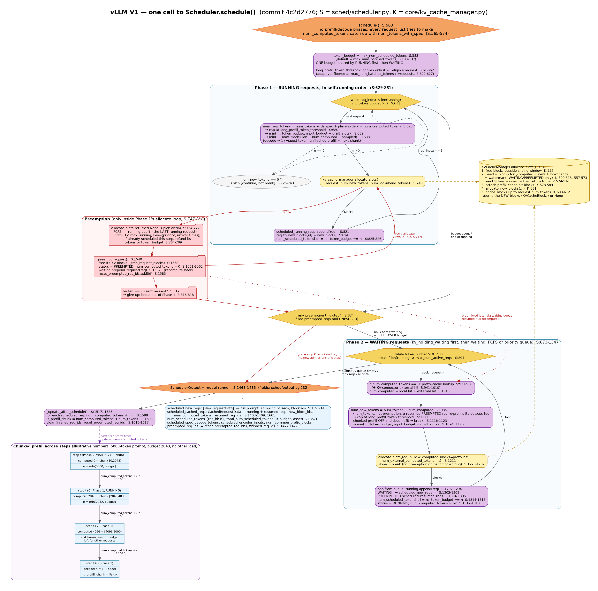
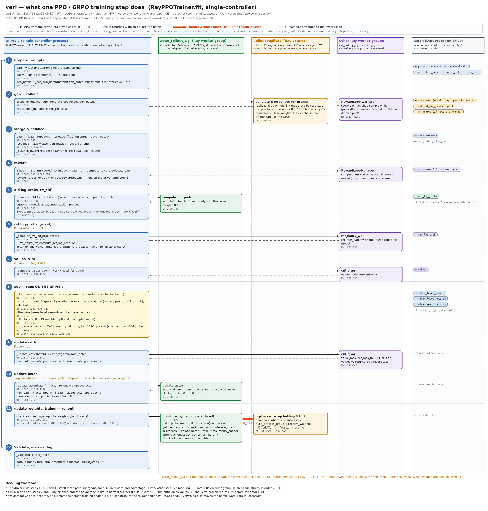
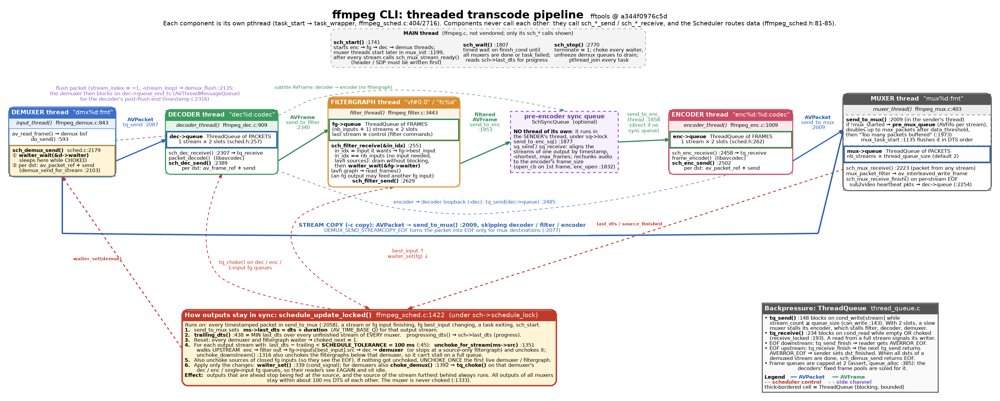
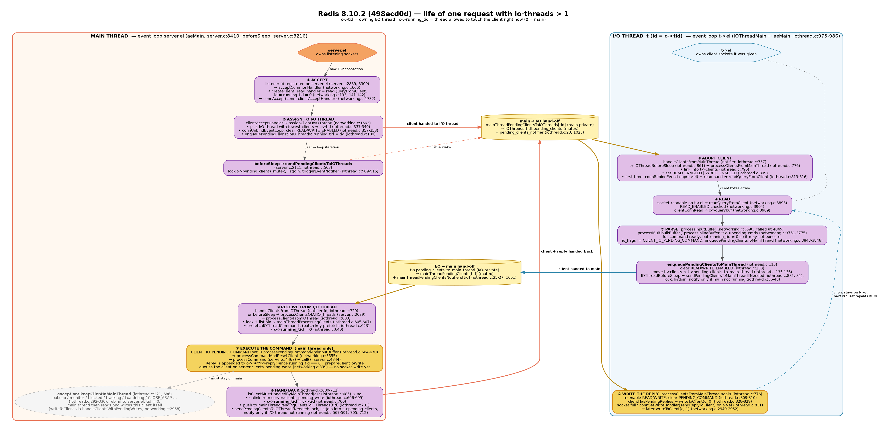
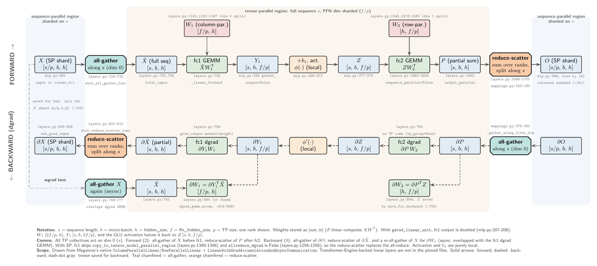
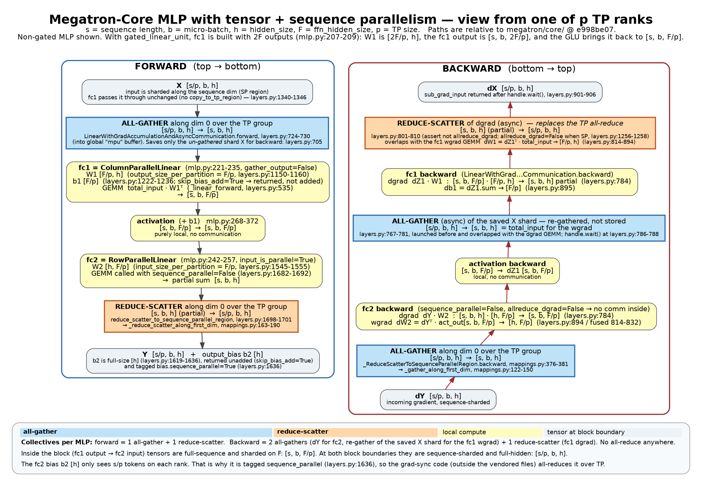
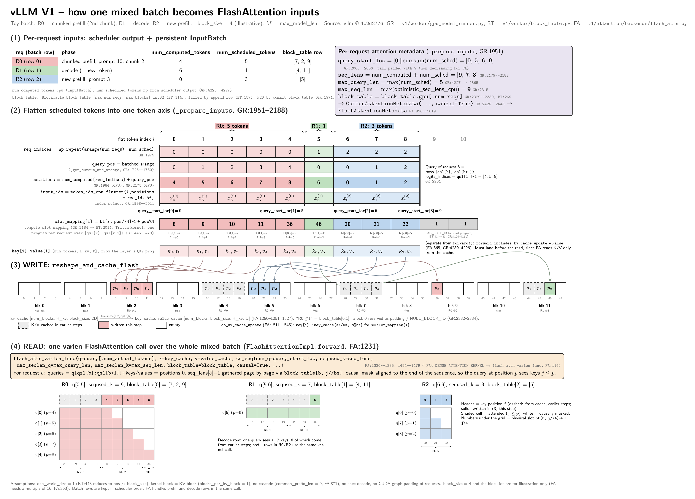

# 绘图 skill A/B 评测报告

评测对象：本仓库的 `drawing-skills` 插件（`graphviz`、`model-architecture` 两个 skill）。每个 case 跑两组：带插件（带 skill）和不带插件（不带 skill），**每组 1 次**；agent 和评委都是 Opus。prompt 不指定画图工具，只要求输出一张 PNG。分数 = render、correctness、readability 三个评分器的通过比例；skill 是否触发只作指示，不计分。美观和配色由人工另行打分（见 PLAN 第 9 步）。

> 每组只有 1 个样本，Δ 和耗时差都是单次观测，不是稳定结论。

**读结果前先看题型。** graphviz skill 是为**架构图**设计的（SKILL.md：“topology-first graphs”，并明确“Not for UML sequence / activity”）。第 1、2 轮的 G1–G4 问的是单步算法、训练步骤顺序、跨线程请求生命周期，属于流程图 / 时序图，**在 graphviz skill 的设计范围之外**；M1、M2 在 model-architecture skill 的范围内。第 3 轮的 A1–A3 是只问组成与连接的架构题，用来测 graphviz skill 的主场。

## 汇总

| Case | 题型 | 得分 带 / 不带 | Δ | agent 耗时 带 / 不带 (s) | agent 花费 带 / 不带 ($) | 轮数 带 / 不带 | skill 路由 | 画图路线 带 / 不带 |
|---|---|---|---|---|---|---|---|---|
| G1 `vllm-v1-schedule` | 流程（单步算法） | 0.67 / 0.67 | +0.00 | 106 / 174 | 0.77 / 0.94 | 19 / 19 | ✅ | Graphviz / Graphviz |
| G2 `verl-ppo-step` | 流程（训练步骤顺序） | 1.00 / 1.00 | +0.00 | 150 / 222 | 1.07 / 1.23 | 30 / 23 | ✅ | Graphviz / Pillow (逐个画形状) |
| G3 `ffmpeg-transcode-threads` | 混合（线程拓扑 + 背压/同步） | 0.67 / 1.00 | -0.33 | 164 / 442 | 1.39 / 1.65 | 27 / 36 | ✅ | Graphviz / Graphviz |
| G4 `redis-request-path` | 时序（跨线程请求生命周期） | 0.67 / 0.67 | +0.00 | 124 / 152 | 0.92 / 0.99 | 18 / 17 | ✅ | Graphviz / Graphviz |
| M1 `megatron-tp-sp-mlp` | 模型内部（张量形状 + 通信） | 1.00 / 1.00 | +0.00 | 187 / 121 | 1.05 / 0.67 | 27 / 18 | ✅ | TikZ / Graphviz |
| M2 `vllm-v1-mixed-batch-attn` | 模型内部（逐 token 元数据） | 0.67 / 1.00 | -0.33 | 329 / 284 | 1.67 / 1.57 | 32 / 25 | ✅ | TikZ / Pillow (逐个画形状) |
| **合计 / 平均** | | **0.78 / 0.89** | **-0.11** | **1060 / 1395** | **6.87 / 7.05** | | | |

agent 花费合计 $13.92，评委花费合计 $2.16，总计 $16.07。

## 一致性 / 可预测性

每个 case 每组只有 1 次运行，所以这里比较的是**同一题型的 case 之间**的波动（每类 2–4 个 case，样本很少，只作参考）。

指标定义：
- **质量一致性** = 1 − 2·σ(得分)。得分在 0–1 之间，σ 最大 0.5，所以 1 = 各 case 得分完全一样，0 = 最分散。
- **耗时 / 花费可预测性** = 1 − CV，CV = σ / 均值（agent 部分，不含评委），截到 0–1。
- **风格一致性** = 各图色相直方图两两交集的均值；只统计有颜色的像素，含浅色填充，忽略白、灰、黑。1 = 配色分布完全相同。
- **看图评分一致性** = 1 − σ(看图均分)/2。看图分是 1–5 分，σ 最大 2，所以范围 0–1。
- σ 用总体标准差。

| 类别 | 组 | n | 得分 均值 [范围] | 质量一致性 | correctness 通过率 | readability 通过率 | 耗时 均值 s (可预测性) | 花费 均值 $ (可预测性) | 风格一致性 | 看图均分 (一致性) | skill 正确触发 |
|---|---|---|---|---|---|---|---|---|---|---|---|
| 流程/时序/混合（graphviz 设计范围外） | 带 skill | 4 | 0.75 [0.67–1.00] | 0.71 | 4/4 | 1/4 | 136 (0.83) | 1.04 (0.78) | 0.67 | 4.0 (1.00) | 4/4 |
|  | 不带 skill | 4 | 0.83 [0.67–1.00] | 0.67 | 4/4 | 2/4 | 248 (0.53) | 1.20 (0.77) | 0.52 | 4.3 (0.88) | – |
| 模型内部（model-architecture 范围内） | 带 skill | 2 | 0.83 [0.67–1.00] | 0.67 | 2/2 | 1/2 | 258 (0.73) | 1.36 (0.77) | 0.43 | 4.7 (0.83) | 2/2 |
|  | 不带 skill | 2 | 1.00 [1.00–1.00] | 1.00 | 2/2 | 2/2 | 203 (0.60) | 1.12 (0.60) | 0.42 | 4.7 (0.83) | – |

## 内容可读性（Claude 逐子问题检查）

只看内容：把每个 prompt 明确问的子问题列出来，看读者能不能从图里直接读到答案。每个子问题 2 = 一眼可读，1 = 在图里但要在小字或代码里找，0 = 读不出或画错。另给一个 1–5 的整体分：读者能不能把题目要的那条主线拼起来。这是模型的判断，不是人工打分。

| Case | 题型 | 子问题得分 带 / 不带 | 内容可读性 (1–5) 带 / 不带 |
|---|---|---|---|
| G1 | 流程（单步算法） | 10/10 / 10/10 | 4 / 5 |
| G2 | 流程（训练步骤顺序） | 7/8 / 8/8 | 4 / 5 |
| G3 | 混合（线程拓扑 + 背压/同步） | 9/10 / 9/10 | 4 / 4 |
| G4 | 时序（跨线程请求生命周期） | 10/10 / 10/10 | 4 / 5 |
| M1 | 模型内部（张量形状 + 通信） | 6/6 / 6/6 | 5 / 4 |
| M2 | 模型内部（逐 token 元数据） | 7/8 / 8/8 | 4 / 5 |
| **合计 / 平均** | | **49/52 / 51/52** | **4.2 / 4.7** |

## Claude 看图评分（1–5）

我逐张检查了所有最终 PNG，按同一标准打分。这是模型打的分，**不是人工美观打分**（人工打分见 PLAN 第 9 步）。标准：
- **信息完整**：题目要求的机制是否都画出来、是否与代码一致；
- **版式清晰**：阅读方向、交叉线、文字大小、留白、分区；
- **配色**：色板克制、颜色有含义、对比度、整体协调。

| Case | 信息完整 带/不带 | 版式清晰 带/不带 | 配色 带/不带 | 均分 带/不带 |
|---|---|---|---|---|
| G1 | 5 / 5 | 3 / 4 | 4 / 4 | 4.0 / 4.3 |
| G2 | 5 / 5 | 3 / 5 | 4 / 4 | 4.0 / 4.7 |
| G3 | 5 / 5 | 3 / 4 | 4 / 4 | 4.0 / 4.3 |
| G4 | 5 / 5 | 3 / 4 | 4 / 3 | 4.0 / 4.0 |
| M1 | 5 / 5 | 5 / 4 | 5 / 4 | 5.0 / 4.3 |
| M2 | 5 / 5 | 4 / 5 | 4 / 5 | 4.3 / 5.0 |

## 总体观察

**一句话：** 前两轮测的大多是 **graphviz skill 设计范围之外的题**（流程/时序）。在这些题上 skill **没让评分更高**（readability 输了 1 个 case，平均 Δ = −0.11），但让 agent **更快、更省、风格更统一**。graphviz 的主场（架构图）放到第 3 轮 A1–A3 去测。

1. **题型和 skill 不对口是主因。** graphviz skill 的模板、7 种语义节点（primary 系统、tool 存储、muted 外部依赖……）和自动布局，都是为了表达"由什么组成、怎么连接"。G1（单步算法）、G2（训练步骤顺序）、G4（跨线程请求生命周期）问的是"先做什么、后做什么、谁交给谁"，本质是流程图 / 时序图。SKILL.md 自己写着 "Not for UML sequence / activity"，但描述里的 "runtime data flow" 让这些题全部触发了它（4/4）。
   - 结果：带 skill 的图都被模板拉成"一条竖直主干 + 旁边分区"的拓扑布局，回边和跨组的边横穿全图。不带 skill 的组更自然地画成泳道、按步骤排的表格或横向流水线（G2、G3、G4），评委更喜欢。
   - G3 是混合题：线程和队列的拓扑在 skill 范围内，背压和 DTS 同步是动态行为。这是唯一一个带 skill 输掉 readability 的 G 类 case。
2. **correctness 已经饱和。** 12 张图 12 张通过（全部 3:0）。Opus 不带 skill 也能读透源码、画全要点，所以 Δ 只来自 readability。
3. **model-architecture 在自己的范围内表现合格。** M1、M2 都正确路由到它并改走 TikZ。M1 是这批图里最像论文插图的一张。M2 输在"写 KV"那一段有十几条交叉弯箭头；不带 skill 的组用"每个 block 一行 + 文字标注槽位"代替连线，更干净。
4. **效率：graphviz 模板在范围外也有效。** G 类 4/4 个 case 带 skill 都更快、更便宜：平均 136 秒 vs 248 秒（−45%），$1.04 vs $1.20（−13%）；耗时可预测性 0.83 vs 0.53。M 类相反：TikZ 要写更多代码、还要编译，带 skill 258 秒 / $1.36，不带 skill 203 秒 / $1.12。
5. **风格一致性：graphviz 的配色模板很稳。**
   - G 类跨 case 的色相相似度：带 skill 0.67，不带 skill 0.52。
   - 同一题（G1）画两次：带 skill 0.93，不带 skill 0.58。
   - M 类两组都在 0.42–0.43：model-architecture 没有统一的色板。
6. **质量一致性差不多。** G 类 0.71 vs 0.67；Claude 看图均分带 skill 4.2、不带 skill 4.4。带 skill 在 G 类"版式清晰"四个都是 3 分：很稳定，但稳定在偏低的位置，这正是模板不适合流程题的表现。

7. **内容可读性：要点覆盖一样，差在"讲解手段"。** 逐个子问题检查，两组几乎都答全了（49/52 vs 51/52），但整体内容可读性带 skill 4.2、不带 skill 4.7。差别不在画没画到，而在读者能不能顺着一条主线读下去：
   - 不带 skill 的图会主动加讲解手段：worked example 表（G1）、"步骤行 × 角色列 + batch 字段列"（G2）、按时间往下走的泳道和一行总结（G4）、用颜色标注代替连线（M2）。
   - graphviz 模板用颜色和形状表示**节点是什么角色**（系统、存储、外部依赖），这正好回答架构和依赖图要回答的问题："有什么、谁依赖谁"。但流程和时序题问的是"什么时候、由谁做"，角色配色帮不上忙，读者得自己把时间线拼出来。
   - 反例是 M1：带 skill 的图用底色划出 SP 区和 TP 区，空间编码正好对应题目问的"在哪里切分"，所以内容可读性反而更高（5 vs 4）。**编码方式和题目问的维度一致时，skill 就能加分。**

**人工评价（用户看图后的判断）：** 流程类题目更适合画成时序图 / 泳道图。G3 FFmpeg 两组**打平**；G1、G2、G4 不带 skill 的泳道 / 表格画法**更清楚**。这和评委的结论**正好错开**：在 G1、G2、G4 上，评委的 readability 没有分出高下（G1、G4 两组都没通过，G2 两组都通过），而人工明确认为不带 skill 的泳道更清楚；在 G3 上，评委判不带 skill 的组完胜（3:0 对 0:3），人工却认为打平。可见在流程题上，评委的通过/不通过和人对版式的判断并不一致，人工打分不能省。这也支持 SKILL-IMPROVEMENTS.md 里 P0"先判断图的类型，再选模板"的建议。

**下一步：**
- 第 3 轮跑 A1–A3 架构题（组件、进程、资源放置、rank 拓扑），看 graphviz skill 在主场上能不能把 readability 和内容可读性也赢回来。目前还缺一个纯**依赖图**题（例如模块或包之间的依赖关系），可以作为下一个补充 case。
- skill 本身暂不修改（用户决定）；[SKILL-IMPROVEMENTS.md](SKILL-IMPROVEMENTS.md) 留作参考。

**局限：** 每个 case 每组只跑了 1 次；G1 跑过三次，带 skill 组的 readability 结果就翻转过一次，看趋势比看单个数字更有意义。评委和看图评分都是模型给出的；人工美观打分（PLAN 第 9 步）还没做。前两轮总花费：冒烟 $3.18 + G1 正式 $2.12 + 第 2 轮 $13.95 = **$19.25**（含评委）。

## 待跑的 case

以下 case 已写好（源码、答案要点、评分器齐全），还没有运行结果：

- A1 `vllm-v1-process-arch`：架构（进程与组件）（[答案要点](evals/vllm-v1-process-arch/answer-key.md)）
- A2 `verl-resource-placement`：架构（资源池与放置）（[答案要点](evals/verl-resource-placement/answer-key.md)）
- A3 `megatron-parallel-groups`：架构（rank 与并行组拓扑）（[答案要点](evals/megatron-parallel-groups/answer-key.md)）

## skill 强化方案

见 [SKILL-IMPROVEMENTS.md](SKILL-IMPROVEMENTS.md)。

## G1 · `vllm-v1-schedule`

**题型：** 流程（单步算法）  
**代码库：** https://github.com/vllm-project/vllm @ `4c2d277643`（main）  
**复制进来的源码：** `vllm/v1/core/sched/scheduler.py`, `vllm/v1/core/sched/output.py`, `vllm/v1/core/sched/request_queue.py`, `vllm/v1/core/kv_cache_manager.py`, `vllm/v1/request.py`  
**答案要点：** [evals/vllm-v1-schedule/answer-key.md](evals/vllm-v1-schedule/answer-key.md)（9 条，通过线 7/9）

**Prompt：**

> I'm trying to understand how vLLM V1 does continuous batching. The scheduler source, pinned at the commit in `PINNED.txt`, is in the read-only source directory available to this session. Draw one diagram that explains what happens in a single scheduler step: how the per-step token budget is shared between already-running requests and waiting requests, how chunked prefill splits a long prompt across steps, where KV cache blocks are allocated, when and how preemption happens, and what the step outputs to the model runner. Ground every element in the code. Save the finished diagram as a PNG image at `out/schedule-step.png`.

**答案要点标题：** 1. Budget source. · 2. Budget decrement. · 3. Running before waiting. · 4. Chunked prefill. · 5. KV block allocation. · 6. Preemption (running side only). · 7. Preemption blocks admission. · 8. Admission stop conditions. · 9. Output to the model runner.

### 评分

| 评分器 | 带 skill | 不带 skill | 说明 |
|---|---|---|---|
| render | ✅ | ✅ | 生成了 PNG |
| correctness | ✅ ✓✓✓ | ✅ ✓✓✓ | 答案要点至少 7/9 画对且无矛盾 |
| readability | ❌ ✗✗✗ | ❌ ✗✗✗ | 可读性（文字、重叠、方向、连线、视觉语法、孤立节点） |
| skill-fired | ✅ | – | 调用了应调用的 skill（只作指示） |
| skill-misrouted | ✅ | – | 没有调用另一个 skill（只作指示） |

### 运行数据（agent 部分不含评委）

| | 带 skill | 不带 skill |
|---|---|---|
| 得分 | 0.67 | 0.67 |
| agent 耗时 (s) | 106.3 | 173.5 |
| agent API 耗时 (s) | 103.7 | 170.4 |
| agent 花费 ($) | 0.768 | 0.939 |
| 评委花费 ($) | 0.192 | 0.221 |
| 轮数 | 19 | 19 |
| 调用的 skill | drawing-skills:graphviz | 无 |
| 最终画图路线 | Graphviz | Graphviz |
| 碰过的绘图工具（含只探测过的） | graphviz | graphviz, matplotlib |
| 越界读文件 | 0 | 0 |
| 错误 | 无 | 无 |

### 内容可读性

| 子问题 | 带 skill | 不带 skill |
|---|---|---|
| token 预算如何在 running / waiting 之间共享 | 2 一眼可读 | 2 一眼可读 |
| chunked prefill 如何跨步切分 | 2 一眼可读 | 2 一眼可读 |
| KV block 在哪里分配 | 2 一眼可读 | 2 一眼可读 |
| 何时、如何抢占 | 2 一眼可读 | 2 一眼可读 |
| 输出给 model runner 什么 | 2 一眼可读 | 2 一眼可读 |
| **整体 (1–5)** | **4** | **5** |

两张都把 5 个子问题答全了。差别在讲解：不带 skill 的图有一张 worked example 表（每一步 running 用多少预算、waiting 拿到多少、P 的已计算长度），把预算共享、running 优先、chunked prefill 三件事放在同一张表里讲清楚，还在标题下直接写出"只有一个共享预算、没有 prefill/decode 阶段"。带 skill 的图也有 chunked prefill 示例，但放在左下角，离切分发生的节点很远，读者要自己把它和 Phase 1/2 对上。

### 最终的图

**带 skill**

**不带 skill**

### 观察

- **两张图在内容上都很完整**：9 条要点两组都画到了，correctness 两组 3 票全过。不带 skill 的 Opus 本身就能把 `schedule()` 读透，所以 correctness 在这个 case 上拉不开差距。
- **两组的 readability 都是 3 票全不过**，原因相近：
  - 原图约 3000×3000，评委看到的是缩到约 1500 宽的 JPEG，等宽小字（行号、公式）在缩小后很难辨认；
  - 两张图都有横穿大半张图的长回边（带 skill 的是红色 retry 边和"re-admitted later"虚线，不带 skill 的是两条 next/req_index 虚线回路）。
- **视觉风格差异明显**：带 skill 的图用了 skill 模板的语义配色（紫色 = 处理步骤、黄色六边形 = 判断、圆柱 = KV 管理器、红色 = 抢占）；不带 skill 的图以白底方框为主，用浅色分区，代码用等宽字体，还附了一个 worked example 表格。两者的优劣留给人工美观打分。
- **效率**：这次带 skill 用了 106 秒、$0.77，不带 skill 用了 174 秒、$0.94，轮数都是 19。带 skill 的组直接套用模板，省掉了自己摸索样式的时间。
- **readability 结果不稳定**：G1 一共跑过三次（冒烟 1 次因权限问题没出图，冒烟 2 次和正式运行各 1 次）。带 skill 的 readability 在冒烟 2 次通过、在正式运行没通过；不带 skill 的两次都没通过。单次结果受画图随机性和评委随机性的双重影响。

## G2 · `verl-ppo-step`

**题型：** 流程（训练步骤顺序）  
**代码库：** https://github.com/volcengine/verl @ `fbb4b3a8bf`（default branch）  
**复制进来的源码：** `verl/trainer/ppo/ray_trainer.py`, `verl/trainer/ppo/core_algos.py`, `verl/checkpoint_engine/base.py`, `verl/workers/engine_workers.py`  
**答案要点：** [evals/verl-ppo-step/answer-key.md](evals/verl-ppo-step/answer-key.md)（9 条，通过线 7/9）

**Prompt：**

> I'm trying to understand how verl runs one PPO/GRPO training step with its single-controller design. The trainer source, pinned at the commit in `PINNED.txt`, is in the read-only source directory available to this session. Draw one diagram that explains what one step of the training loop does: the order of rollout, reward, old and reference log-probs, values, advantage, critic and actor updates; which work runs on the driver and which on Ray worker groups; what accumulates in the batch along the way; and where the weights move between the trainer and the rollout engine. Ground every element in the code. Save the finished diagram as a PNG image at `out/ppo-step.png`.

**答案要点标题：** 1. Single controller, one step per batch. · 2. Rollout, then the rollout engine sleeps. · 3. Batch accumulation. · 4. Reward. · 5. Old log-probs by the actor worker group. · 6. Optional reference and critic passes. · 7. Advantage on the driver. · 8. Updates on worker groups. · 9. Weight sync trainer → rollout.

### 评分

| 评分器 | 带 skill | 不带 skill | 说明 |
|---|---|---|---|
| render | ✅ | ✅ | 生成了 PNG |
| correctness | ✅ ✓✓✓ | ✅ ✓✓✓ | 答案要点至少 7/9 画对且无矛盾 |
| readability | ✅ ✓✗✓ | ✅ ✓✓✓ | 可读性（文字、重叠、方向、连线、视觉语法、孤立节点） |
| skill-fired | ✅ | – | 调用了应调用的 skill（只作指示） |
| skill-misrouted | ✅ | – | 没有调用另一个 skill（只作指示） |

### 运行数据（agent 部分不含评委）

| | 带 skill | 不带 skill |
|---|---|---|
| 得分 | 1 | 1 |
| agent 耗时 (s) | 149.8 | 222.5 |
| agent API 耗时 (s) | 145.5 | 218.1 |
| agent 花费 ($) | 1.067 | 1.232 |
| 评委花费 ($) | 0.182 | 0.166 |
| 轮数 | 30 | 23 |
| 调用的 skill | drawing-skills:graphviz | 无 |
| 最终画图路线 | Graphviz | Pillow (逐个画形状) |
| 碰过的绘图工具（含只探测过的） | graphviz | matplotlib, pillow |
| 越界读文件 | 0 | 0 |
| 错误 | 无 | 无 |

### 内容可读性

| 子问题 | 带 skill | 不带 skill |
|---|---|---|
| 各阶段的先后顺序 | 2 一眼可读 | 2 一眼可读 |
| 哪些在 driver、哪些在 worker group | 2 一眼可读 | 2 一眼可读 |
| batch 一路累积了什么 | 1 要找 | 2 一眼可读 |
| 权重在哪里、怎么从训练端到 rollout 端 | 2 一眼可读 | 2 一眼可读 |
| **整体 (1–5)** | **4** | **5** |

带 skill 的图顺序清楚（0–10 编号的 driver 主干），但每一步新增的 batch 字段写成节点里的绿色小字，要逐个节点去找；worker group 在左侧，RPC 边从右向左横穿，读者要来回对照。不带 skill 的图是"步骤行 × 角色列"的表格，最右一列专门写"batch 新增了哪些 key"，四个子问题都能按行直接读到，第 11 行用红色粗箭头标出 θ_k+1 从 actor 到 rollout。

### 最终的图

**带 skill**

**不带 skill**

### 观察

- **画图路线**：带 skill 用 graphviz skill 模板（Graphviz）；不带 skill **自己写了 358 行 Pillow（`ImageDraw`）脚本**，逐个画矩形和箭头，做成"步骤行 × 角色列"的泳道表格。
- **两张图内容都完整**，correctness 两组 3 票全过：rollout → sleep → reward → old/ref log-prob → values → driver 上算 advantage → critic/actor 更新 → `update_weights` 同步权重，都画到了，也都区分了 driver 和 Ray worker group。
- **版式差异大**：
  - 带 skill：driver 一列竖排 + 左侧 worker 分区，RPC 边从右往左横穿，加上 sleep/wake 和 gen_output 两条绕全图的长虚线，交叉较多；advantage 用了一个很大的六边形。
  - 不带 skill：12 个步骤一行一个，列依次是 driver / actor_rollout_wg / rollout replicas / 其他 worker group / batch 字段，最右列逐步标出 batch 新增了哪些 key。这是本轮最清楚的一张图之一。
- **评委**：两组 readability 都通过（带 skill 2:1，不带 skill 3:0）。
- **效率**：带 skill 150 秒 / $1.07 / 30 轮，不带 skill 223 秒 / $1.23 / 23 轮。不带 skill 轮数更少但更慢，时间主要花在生成长脚本上。

## G3 · `ffmpeg-transcode-threads`

**题型：** 混合（线程拓扑 + 背压/同步）  
**代码库：** https://github.com/FFmpeg/FFmpeg @ `a344f0976c`（default branch）  
**复制进来的源码：** `fftools/ffmpeg_sched.h`, `fftools/ffmpeg_sched.c`, `fftools/thread_queue.c`, `fftools/ffmpeg_demux.c`, `fftools/ffmpeg_dec.c`, `fftools/ffmpeg_filter.c`, `fftools/ffmpeg_enc.c`, `fftools/ffmpeg_mux.c`  
**答案要点：** [evals/ffmpeg-transcode-threads/answer-key.md](evals/ffmpeg-transcode-threads/answer-key.md)（8 条，通过线 6/8）

**Prompt：**

> I'm trying to understand how the ffmpeg command-line tool runs a transcode with threads. The fftools source, pinned at the commit in `PINNED.txt`, is in the read-only source directory available to this session. Draw one diagram that explains the threaded transcoding pipeline: which threads exist, what queues sit between them, how packets and frames flow from demuxer to muxer (including stream copy), how backpressure works, and how the scheduler keeps the outputs in sync. Ground every element in the code. Save the finished diagram as a PNG image at `out/transcode-threads.png`.

**答案要点标题：** 1. Scheduler in the middle. · 2. One thread per component. · 3. Queues sit at the consumer's input. · 4. Data path. · 5. Thread loop. · 6. Bounded queues = backpressure. · 7. Sync by muxer DTS. · 8. Choking a demuxer.

### 评分

| 评分器 | 带 skill | 不带 skill | 说明 |
|---|---|---|---|
| render | ✅ | ✅ | 生成了 PNG |
| correctness | ✅ ✓✓✓ | ✅ ✓✓✓ | 答案要点至少 6/8 画对且无矛盾 |
| readability | ❌ ✗✗✗ | ✅ ✓✓✓ | 可读性（文字、重叠、方向、连线、视觉语法、孤立节点） |
| skill-fired | ✅ | – | 调用了应调用的 skill（只作指示） |
| skill-misrouted | ✅ | – | 没有调用另一个 skill（只作指示） |

### 运行数据（agent 部分不含评委）

| | 带 skill | 不带 skill |
|---|---|---|
| 得分 | 0.67 | 1 |
| agent 耗时 (s) | 164.2 | 442.4 |
| agent API 耗时 (s) | 159.5 | 435.6 |
| agent 花费 ($) | 1.386 | 1.652 |
| 评委花费 ($) | 0.178 | 0.188 |
| 轮数 | 27 | 36 |
| 调用的 skill | drawing-skills:graphviz | 无 |
| 最终画图路线 | Graphviz | Graphviz |
| 碰过的绘图工具（含只探测过的） | graphviz | matplotlib, graphviz, pillow |
| 越界读文件 | 0 | 0 |
| 错误 | 无 | 无 |

### 内容可读性

| 子问题 | 带 skill | 不带 skill |
|---|---|---|
| 有哪些线程 | 2 一眼可读 | 2 一眼可读 |
| 线程之间有哪些队列 | 2 一眼可读 | 2 一眼可读 |
| 包/帧怎么流动（含 stream copy） | 2 一眼可读 | 2 一眼可读 |
| 背压怎么产生 | 1 要找 | 1 要找 |
| 调度器如何让输出保持同步 | 2 一眼可读 | 2 一眼可读 |
| **整体 (1–5)** | **4** | **4** |

两张内容几乎一样完整，背压都只写在单独的说明框里，没有在队列上标出"满了会阻塞"。带 skill 的图按组件类型上色，把 Scheduler 和各个 waiter、队列之间的控制关系画成了真实的边，拓扑交代得更完整；不带 skill 的图横向流水线更顺，同步算法用编号步骤写在底部大框里。内容上打平，和人工判断一致。

### 最终的图

**带 skill**

**不带 skill**

### 观察

- **画图路线**：两组最后都用 Graphviz。不带 skill 的组先检查过 matplotlib 和 Pillow 是否可用，最后选了 `dot`。
- **内容**：两组都完整（correctness 3:0）：每个组件一个线程、队列在消费者入口、2 槽有界队列 = 背压、按 muxer DTS 暂停/放行 demuxer、stream copy 直通 muxer。两组还都额外画了 pre-mux 队列和 sync queue。
- **版式**：
  - 带 skill：竖排流水线，Scheduler 放在右侧中部，choke/unchoke 红虚线、stream copy 橙色粗曲线、DTS 上报虚线从右侧大幅绕回，交叉多，右半边空白也多。评委 readability 0:3。
  - 不带 skill：横排 demux → dec → filter → enc → mux，每个线程是"标题 + 队列 + 收发"的 record 卡片，下方一个大框讲同步算法，一个框讲背压。阅读方向清楚，评委 3:0。
- **效率**：带 skill 164 秒 / $1.39 / 27 轮；不带 skill **442 秒** / $1.65 / 36 轮，是本轮最慢的一次，主要在反复调整版式。
- **人工评价**：两组打平。带 skill 的竖排图把 Scheduler 和各队列的拓扑交代得更完整；不带 skill 的横排流水线读起来更顺。评委的 3:0 对 0:3 夸大了两者的差距。

## G4 · `redis-request-path`

**题型：** 时序（跨线程请求生命周期）  
**代码库：** https://github.com/redis/redis @ `498ecd0d6d`（8.10.2）  
**复制进来的源码：** `src/ae.c`, `src/ae.h`, `src/networking.c`, `src/iothread.c`, `src/server.c`  
**答案要点：** [evals/redis-request-path/answer-key.md](evals/redis-request-path/answer-key.md)（9 条，通过线 7/9）

**Prompt：**

> I'm trying to understand how Redis 8 handles a client request when I/O threads are enabled (`io-threads` greater than 1). The Redis source, pinned at the tag and commit in `PINNED.txt`, is in the read-only source directory available to this session. Draw one diagram that explains the life of one request across the main thread and an I/O thread: which thread accepts the connection, which reads and parses the query, which executes the command, which writes the reply, and how the client is handed between threads. Ground every element in the code. Save the finished diagram as a PNG image at `out/request-path.png`.

**答案要点标题：** 1. Accept and assign on the main thread. · 2. Hand-off to the I/O thread. · 3. I/O thread binds the client. · 4. Read and parse in the I/O thread. · 5. The I/O thread never executes commands. · 6. Batched hand-back. · 7. Execute on the main thread. · 8. Return trip and write in the I/O thread. · 9. Main thread owns client lifetime.

### 评分

| 评分器 | 带 skill | 不带 skill | 说明 |
|---|---|---|---|
| render | ✅ | ✅ | 生成了 PNG |
| correctness | ✅ ✓✓✓ | ✅ ✓✓✓ | 答案要点至少 7/9 画对且无矛盾 |
| readability | ❌ ✓✗✗ | ❌ ✗✗✗ | 可读性（文字、重叠、方向、连线、视觉语法、孤立节点） |
| skill-fired | ✅ | – | 调用了应调用的 skill（只作指示） |
| skill-misrouted | ✅ | – | 没有调用另一个 skill（只作指示） |

### 运行数据（agent 部分不含评委）

| | 带 skill | 不带 skill |
|---|---|---|
| 得分 | 0.67 | 0.67 |
| agent 耗时 (s) | 123.7 | 151.9 |
| agent API 耗时 (s) | 120.9 | 147.8 |
| agent 花费 ($) | 0.921 | 0.986 |
| 评委花费 ($) | 0.160 | 0.189 |
| 轮数 | 18 | 17 |
| 调用的 skill | drawing-skills:graphviz | 无 |
| 最终画图路线 | Graphviz | Graphviz |
| 碰过的绘图工具（含只探测过的） | graphviz | graphviz, matplotlib |
| 越界读文件 | 0 | 0 |
| 错误 | 无 | 无 |

### 内容可读性

| 子问题 | 带 skill | 不带 skill |
|---|---|---|
| 哪个线程 accept | 2 一眼可读 | 2 一眼可读 |
| 哪个线程读取和解析 | 2 一眼可读 | 2 一眼可读 |
| 哪个线程执行命令 | 2 一眼可读 | 2 一眼可读 |
| 哪个线程写回复 | 2 一眼可读 | 2 一眼可读 |
| 客户端如何在线程之间交接 | 2 一眼可读 | 2 一眼可读 |
| **整体 (1–5)** | **4** | **5** |

两张都用编号步骤答全了 5 个子问题。差别在时间线：不带 skill 的图有三条泳道（主线程 / 交接队列 / I/O 线程），步骤 ①–⑫ 从上到下按时间之字形往返，读者顺着编号往下看就是一次请求的生命周期，底部还有一行总结"accept ① 和 execute ⑨ 在主线程；read ⑤、parse ⑥、write ⑫ 在 I/O 线程"，直接回答了题目。带 skill 的图步骤 ①② 在左上、③–⑤ 在右侧、⑥–⑧ 在左下，中间大片空白，时间顺序要靠编号来回跳着找。

### 最终的图

**带 skill**

**不带 skill**

### 观察

- **画图路线**：两组都用 Graphviz。不带 skill 的组把 `.dot` 写在临时目录，`out/` 里只留了 PNG。
- **内容**：两组都完整（correctness 3:0）：accept + 分配给最空闲的 I/O 线程、I/O 线程读取和解析、命令只在主线程执行、回复由 I/O 线程写、批量交接（16 个或睡眠前）、必须留在主线程的客户端。
- **版式**：
  - 带 skill：左右两条泳道（主线程 / I/O 线程），中间两个交接队列圆柱。图很宽（4001×1955），节点里塞满行号，缩小后字很小。评委 readability 1:2。
  - 不带 skill：三条泳道（主线程 / 交接队列 / I/O 线程），12 个编号步骤之字形往返，结构很清楚；配色比较素，基本是白底卡片。评委 readability 0:3，可能也是因为图太高、字太小。
- **效率**：带 skill 124 秒 / $0.92 / 18 轮，不带 skill 152 秒 / $0.99 / 17 轮。

## M1 · `megatron-tp-sp-mlp`

**题型：** 模型内部（张量形状 + 通信）  
**代码库：** https://github.com/NVIDIA/Megatron-LM @ `e998be072d`（default branch）  
**复制进来的源码：** `megatron/core/tensor_parallel/layers.py`, `megatron/core/tensor_parallel/mappings.py`, `megatron/core/transformer/mlp.py`  
**答案要点：** [evals/megatron-tp-sp-mlp/answer-key.md](evals/megatron-tp-sp-mlp/answer-key.md)（8 条，通过线 6/8）

**Prompt：**

> I'm trying to understand tensor parallelism with sequence parallelism in Megatron-Core. The source, pinned at the commit in `PINNED.txt`, is in the read-only source directory available to this session. Draw one diagram of a single transformer MLP block (fc1 → activation → fc2) on one of p tensor-parallel ranks with sequence parallelism enabled. Show the per-rank tensor and weight shapes in terms of s, b, h, the FFN hidden size and p, and where all-gather and reduce-scatter happen, in both the forward and the backward pass. Ground every element in the code. Save the finished diagram as a PNG image at `out/tp-sp-mlp.png`.

**答案要点标题：** 1. Sequence-sharded input. · 2. fc1 is column-parallel. · 3. Forward all-gather before fc1. · 4. Local activation. · 5. fc2 is row-parallel. · 6. Forward reduce-scatter after fc2. · 7. Backward of fc2's reduce-scatter. · 8. Backward of fc1.

### 评分

| 评分器 | 带 skill | 不带 skill | 说明 |
|---|---|---|---|
| render | ✅ | ✅ | 生成了 PNG |
| correctness | ✅ ✓✓✓ | ✅ ✓✓✓ | 答案要点至少 6/8 画对且无矛盾 |
| readability | ✅ ✓✓✓ | ✅ ✓✗✓ | 可读性（文字、重叠、方向、连线、视觉语法、孤立节点） |
| skill-fired | ✅ | – | 调用了应调用的 skill（只作指示） |
| skill-misrouted | ✅ | – | 没有调用另一个 skill（只作指示） |

### 运行数据（agent 部分不含评委）

| | 带 skill | 不带 skill |
|---|---|---|
| 得分 | 1 | 1 |
| agent 耗时 (s) | 187.3 | 120.8 |
| agent API 耗时 (s) | 178.8 | 118.2 |
| agent 花费 ($) | 1.053 | 0.669 |
| 评委花费 ($) | 0.134 | 0.166 |
| 轮数 | 27 | 18 |
| 调用的 skill | drawing-skills:model-architecture | 无 |
| 最终画图路线 | TikZ | Graphviz |
| 碰过的绘图工具（含只探测过的） | tikz/latex | matplotlib, graphviz |
| 越界读文件 | 0 | 0 |
| 错误 | 无 | 无 |

### 内容可读性

| 子问题 | 带 skill | 不带 skill |
|---|---|---|
| 每个 rank 上的张量和权重形状 | 2 一眼可读 | 2 一眼可读 |
| 前向在哪里 all-gather / reduce-scatter | 2 一眼可读 | 2 一眼可读 |
| 反向在哪里 all-gather / reduce-scatter | 2 一眼可读 | 2 一眼可读 |
| **整体 (1–5)** | **5** | **4** |

两张都答全。带 skill 的 TikZ 图把"按序列切分的 SP 区"和"按 FFN 切分的 TP 区"画成两块底色，前向和反向上下镜像，读者一眼就能看出张量在哪里从 [s/p,b,h] 变成 [s,b,F/p]，通信节点用倒角框、用颜色区分 all-gather 和 reduce-scatter。不带 skill 的图信息相同，但写成左右两列文字卡片，形状要从文字里读出来；好在底部有一行"每个 MLP 前向 1 次 all-gather + 1 次 reduce-scatter、反向 2 次 all-gather + 1 次 reduce-scatter"的总结。

### 最终的图

**带 skill**

**不带 skill**

### 观察

- **画图路线**：带 skill 正确路由到 **model-architecture** skill，用 **TikZ**（174 行 `.tex`，XeLaTeX 编译）；不带 skill 用 Graphviz 画成两栏流程图。这是 skill 对路线影响最明显的 case。
- **内容**：两组都完整（correctness 3:0），每个 rank 上的形状、前向 all-gather/reduce-scatter、反向 all-gather/reduce-scatter 和为 wgrad 重新 all-gather 都画到了。
- **版式**：
  - 带 skill：论文风格的横向数据流，前向和反向上下镜像，SP 区和 TP 区用底色分开，通信节点用倒角框（青 = all-gather，橙 = reduce-scatter），单独一条 wgrad 泳道。本轮最"专业"的一张。
  - 不带 skill：左前向、右反向两个框，按通信类型配色并附图例，信息同样完整，但更像文字卡片串。
- **评委**：两组 readability 都通过（带 skill 3:0，不带 skill 2:1）。
- **效率**：带 skill 187 秒 / $1.05 / 27 轮，不带 skill **121 秒 / $0.67** / 18 轮。TikZ 路线写得更多、编译更慢，所以这次带 skill 反而更慢更贵。

## M2 · `vllm-v1-mixed-batch-attn`

**题型：** 模型内部（逐 token 元数据）  
**代码库：** https://github.com/vllm-project/vllm @ `4c2d277643`（default branch）  
**复制进来的源码：** `vllm/v1/worker/gpu_model_runner.py`, `vllm/v1/worker/block_table.py`, `vllm/v1/attention/backends/flash_attn.py`  
**答案要点：** [evals/vllm-v1-mixed-batch-attn/answer-key.md](evals/vllm-v1-mixed-batch-attn/answer-key.md)（9 条，通过线 7/9）

**Prompt：**

> I'm trying to understand how vLLM V1's GPU model runner turns one mixed batch, where some requests prefill a chunk and others decode one token, into attention inputs. The source, pinned at the commit in `PINNED.txt`, is in the read-only source directory available to this session. Draw one diagram that uses a small concrete example batch to show how the scheduled tokens are flattened; how `query_start_loc`, `seq_lens`, `block_table` and `slot_mapping` are built; and how the FlashAttention backend uses them to write the new K/V into the paged KV cache and read it back. Ground every element in the code. Save the finished diagram as a PNG image at `out/mixed-batch-attn.png`.

**答案要点标题：** 1. One flat token array. · 2. Per-request offsets. · 3. Positions continue from computed tokens. · 4. Input ids gathered. · 5. query_start_loc. · 6. seq_lens. · 7. block_table. · 8. slot_mapping. · 9. Write then read in one kernel call.

### 评分

| 评分器 | 带 skill | 不带 skill | 说明 |
|---|---|---|---|
| render | ✅ | ✅ | 生成了 PNG |
| correctness | ✅ ✓✓✓ | ✅ ✓✓✓ | 答案要点至少 7/9 画对且无矛盾 |
| readability | ❌ ✗✗✗ | ✅ ✓✓✓ | 可读性（文字、重叠、方向、连线、视觉语法、孤立节点） |
| skill-fired | ✅ | – | 调用了应调用的 skill（只作指示） |
| skill-misrouted | ✅ | – | 没有调用另一个 skill（只作指示） |

### 运行数据（agent 部分不含评委）

| | 带 skill | 不带 skill |
|---|---|---|
| 得分 | 0.67 | 1 |
| agent 耗时 (s) | 329.2 | 284.3 |
| agent API 耗时 (s) | 316.8 | 277.0 |
| agent 花费 ($) | 1.674 | 1.570 |
| 评委花费 ($) | 0.189 | 0.191 |
| 轮数 | 32 | 25 |
| 调用的 skill | drawing-skills:model-architecture | 无 |
| 最终画图路线 | TikZ | Pillow (逐个画形状) |
| 碰过的绘图工具（含只探测过的） | tikz/latex | matplotlib, pillow, svg |
| 越界读文件 | 0 | 0 |
| 错误 | 无 | 无 |

### 内容可读性

| 子问题 | 带 skill | 不带 skill |
|---|---|---|
| 混合 batch 如何展平成一维 | 2 一眼可读 | 2 一眼可读 |
| query_start_loc / seq_lens / block_table / slot_mapping 如何构造 | 2 一眼可读 | 2 一眼可读 |
| 新 K/V 如何写进分页 cache | 1 要找 | 2 一眼可读 |
| attention 如何读回 | 2 一眼可读 | 2 一眼可读 |
| **整体 (1–5)** | **4** | **5** |

两张都用具体的小 batch 逐 token 列表，内容都很完整。带 skill 的图"写入"一段有十几条弯箭头把 token 连到 cache 槽位，要顺着交叉的线去对应，是唯一扣分的子问题；读回部分为每个请求画了因果 mask 网格，很直观。不带 skill 的图每个请求固定一种颜色贯穿全图，写入用"每个 block 一行 + ← t1–t4 → slots 92–95"的文字标注代替连线，读者不用追线。

### 最终的图

**带 skill**

**不带 skill**

### 观察

- **画图路线**：带 skill 路由到 **model-architecture** skill，用 **TikZ**（268 行 `.tex`）；不带 skill **自己写了 431 行 Pillow 脚本**逐格绘制。
- **内容**：两张都非常完整（correctness 3:0），都用了具体的玩具 batch，把 `req_indices / query_pos / positions / input_ids / slot_mapping` 逐 token 列成表，画出 KV block 的写入和 varlen attention 的因果 mask。
- **版式**：
  - 带 skill：四段式（输入 → 展平 → 写 → 读），排版像论文插图；但"写"那一段有十几条弯箭头从 token 指向 block，彼此交叉，整体字很小。评委 readability 0:3。
  - 不带 skill：0–6 共 7 个面板，每个请求固定一种颜色贯穿全图，`seq_lens` / `block_table` 用合并单元格表示，写入用"block 行 + 箭头注释"代替连线，更干净。评委 3:0。
- **效率**：带 skill 329 秒 / $1.67 / 32 轮（本轮带 skill 中最慢）；不带 skill 284 秒 / $1.57 / 25 轮。两组都很贵，因为都在逐格排版。

