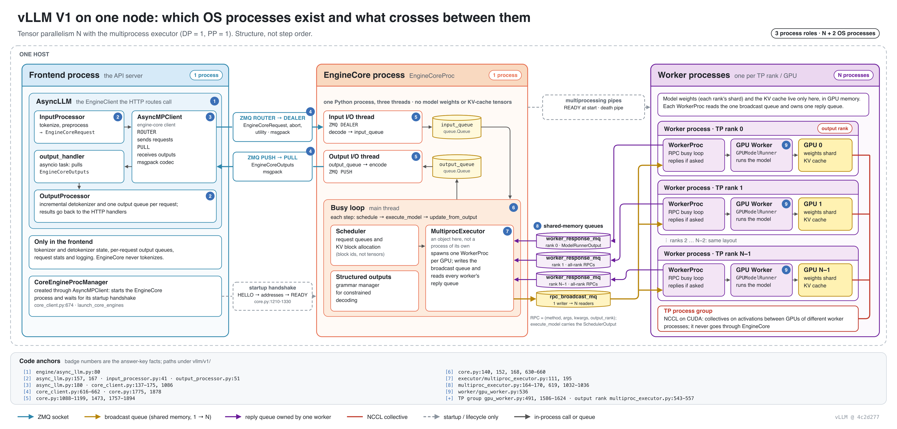
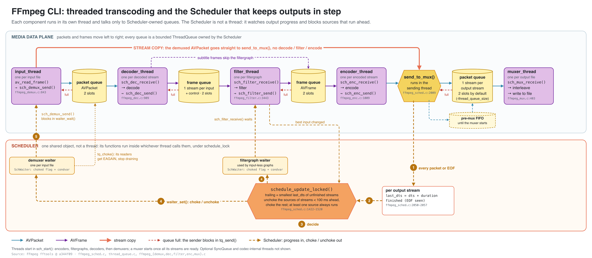
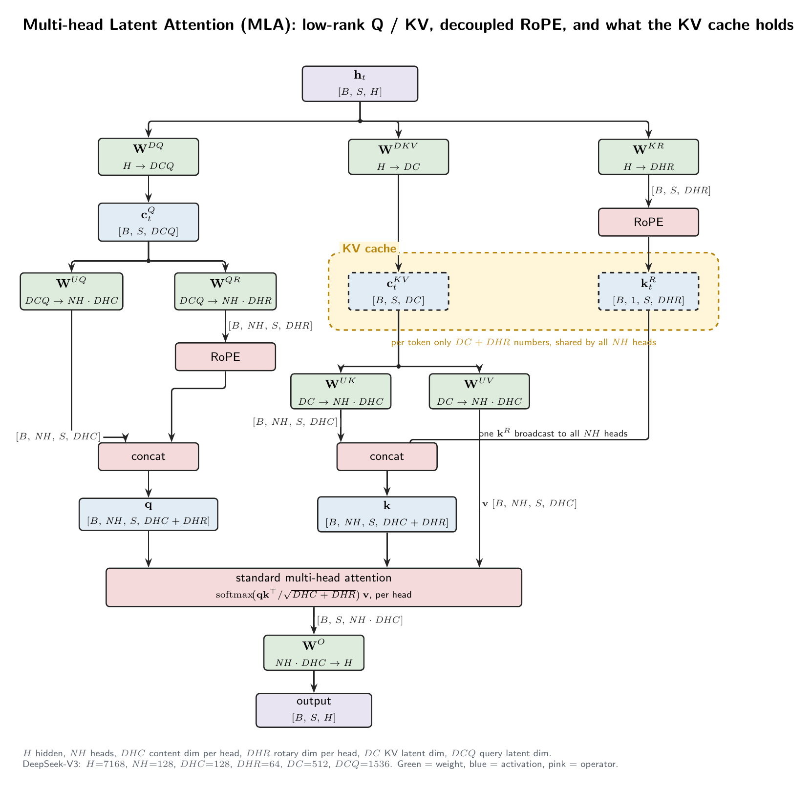

# 下一轮计划：skill 改进与 benchmark v2

这份文档是向前看的计划，从 [10 月 4 日的 54 图盲评](../../comparisons/2026-10-04-blind-54/REPORT.md)得出。那份报告只记录已完成的实验；这里记录据此提出的 skill 改进建议、下一轮测试集的决定，以及各 case 的 golden。golden 总表见 [GOLDENS.md](GOLDENS.md)，图和源文件在 [goldens/](goldens/)，认可的 vault 参考图在 [approved-vault-examples/](approved-vault-examples/)。

## Claude Opus 的建议：如何改进 skill

这些建议的依据有：
- 两份 `SKILL.md` 及其模板；
- skill arm 的 18 张输出；
- 你按方面编码的评语和 Fable 列出的带出处的缺陷；
- 同一个 skill 在日常使用中画的、你 Obsidian vault 里的 103 张 Graphviz 图的测量结果。

目前还没有改动任何 skill 文件。

### 1. 诊断：skill 在日常范围内好用，但必须学会处理密集的图

同一个 skill、同样的配色和节点类别，在 vault 里画出来的图清楚，在评测里画出来的图看不清。区别在于规模和用途。两边用同样的方法测量（`dot -Tjson`，每张图缩放到 1600×1000 的屏幕）：

| 指标 | Vault（103 张 Graphviz 图） | 评测 skill arm（14 张 Graphviz 图） |
|---|---|---|
| 每张图的节点数 | **中位数 10**（IQR 7–12） | 中位数约 20（6–30） |
| 缩放后节点字号中位数 | **16.2 px**（IQR 12.5–20.3） | 4.2–9.6 px |
| 字号 ≥ 11 px 的图 | **87 / 103** | 1 / 14 |
| 每张图的边标签数 | 中位数 6 | — |
| 节点面积 / 画布面积 | 中位数 0.21 | 0.08–0.40 |
| 宽高比 > 3（宽横幅） | 26 / 103 | 0 |
| 用途 | 每张图回答一个问题；一个主题画多张图（sglang-radix 6 张，mooncake 19 张） | 一张大而全的图：「每个元素都要有代码依据」，所有进程、组件和传输方式 |

两边的留白差不多：画布稀疏是 Graphviz 的排版方式，在十个节点左右时不碍事。让评测图崩掉的是节点数乘以每个节点的文字量，而评测的题目同时要求这两样。

你喜欢的两张评测图证明了 skill 在范围内是好用的：A1 `44dce42a`（进程包含关系）和 G1 `1eba22c4`（调度器控制流）。你最差评的 skill 图都超出了这个范围：G1 `db0db3ff`（28 个节点，7957 px 宽，横竖混排）和 G4 `7d98c63e`（四个参与方的密集请求路径挤成一条竖链，宽高比 0.29）。

**这不是借口。** 这次评测说明，密集的单图需求可以处理得更好：同样是大而全的题目，每个模型的 8 个 case 里，no-skill 有 6 个在 Fable 技术分上赢了 skill；你最喜欢的几张图里，好几张都是非常密集的 no-skill 图（G2 `b22ede75`：12 步 × 5 条泳道外加账本；G1 `3f2ea037`：分阶段面板；G4 `a99b55ec`：泳道）。这些 agent 选的都是为密度设计的布局，比如对齐的泳道、面板和结构化单元格，而不是一张自动布局的图。skill 则不管密度如何，把每个需求都塞进一张自动布局的图。所以目标是两方面的：日常范围保持现在的水准；同时给 skill 处理密集图的手段，让它在大而全的需求上追平或超过 no-skill。

### 2. skill 做得好、必须保留的地方

| 优势 | 依据 |
|---|---|
| **声明式、可编辑的源文件** | skill 的 18 张输出全部留下了 `.dot`/`.tex`；DOT 没有写死的坐标，改了内容会自动重新布局。10 月 4 日 no-skill 的每个 SVG 带着约 500 个写死的坐标；ImageGen 没有任何东西可以改 |
| **统一的风格** | vault 里 103 张 Graphviz 图和 24 张 TikZ 图，跨 9 个月、9 个项目，看起来是同一个系列。评测里 skill 只收到 2 条风格抱怨，no-skill 8 条（其中 4 条是深色主题），ImageGen 12 条 |
| **结构优先，所以内容完整** | 你的内容编码：skill +7 / −1，no-skill +1 / −1，ImageGen +4 / −5。两轮准确度都是 5.00，没有实质性错误；声明出来的边不会像手画的箭头那样连错 |
| **一套对应角色的词汇** | 橙色六边形 = 入口或锚点，黄色六边形 = 决策或闸门，紫色框 = 步骤或组件，圆柱 = 存储或缓冲，灰色虚线 = 外部或已弃用。它诞生于多 agent 的 Timely RFC 图，干净地沿用到了系统图上（mooncake、Ray、tokenlake） |
| **画张量内部结构选对了渲染器** | 用 model-architecture 画的 M1 是两位评审都排第一的唯一一张；它的「渲染 → 检查 → 修复」循环正是 Graphviz skill 缺少的 |

配色保留。skill arm 收到的两条风格抱怨都针对大面积填色，不是颜色本身。

### 3. P0 — Graphviz：把验证过的模式写成规则

这些模式已经出现在 vault 和评测里的好图中。把它们写进 `SKILL.md`，习惯就变成了默认做法：

1. **用一张注释卡写明图的论点。** vault 里 103 张图有 20 张这样做：「三道门互相独立」「正确比较单位」「同名但不是同一实现」「thrashing 的机制」。结论用黄色注释卡，陷阱用红色注释卡。一张图回答一个问题，就应该把答案写出来。
2. **边标签承载含义。** vault 每张图的边标签中位数是 6 个：API 调用、命令行参数、传输方式、条件（「小对象：inline / 大对象：隐式 put」、`--hicache-storage-backend mooncake`、「元数据 RPC（不走数据）」）。这和你说过的「标签写在边上」的偏好一致。
3. **在拓扑图里用带编号的边表示顺序。** tokenlake-interface-flow 用 ① `get_prefix_tree()` … ⑦ `put(kv_buf)` 表示顺序，没有用泳道。对于八步以内的调用顺序，这是合适的工具。
4. **cluster 只用来表示真实的边界。** OS 进程（A1 `44dce42a`）、层次（推理引擎 → 缓存管理层 → 适配器 → Mooncake）、平面（控制平面和数据平面）、互相竞争的路线（路线一和路线二）、状态和算法（sglang radix tree 和 `evict()`）。cluster 的标题写明这条边界是什么。
5. **内容丰富的连接画成链路框。** 一条连接有传输方式、载荷和生命周期时，在两个边界之间给它一个单独的框（A1 `44dce42a`：「FRONTEND ↔ ENGINECORE IPC」），而不是写一条很长的边标签。
6. **「阶段 × 负责方」网格。** 行是阶段 cluster，列是每个负责方各自纵向对齐的流水线，每个负责方的路线用自己的边颜色，触发条件写在边上（Timely RFC：Agent Tree → Checkpoint Sinks → Batch Accumulators → Training，每个模型一列）。这是泳道图（第 5 节）的轻量形式：阶段少、单元格短时用它，步骤多、单元格内容丰富时用完整的泳道模板。
7. **控制流就按控制流来画。** 循环画成回边，决策画成黄色六边形，分支条件写在边上，阶段画成标题里带代码行号范围的 cluster（G1 `1eba22c4`）。
8. **代码引用用缩写说明。** 「S = sched/scheduler.py，K = core/kv_cache_manager.py」这样，引用就可以写成 `S:631`。图比较大时，把引用移到图下方的编号表里。

### 4. P0 — Graphviz：发现密度过高并处理

skill 需要察觉一张图什么时候超出了它擅长的范围。超出之后有两种做法：按问题拆分（就像你在 vault 里手工做的那样）；如果要求只画一张图，就换成为密度设计的布局。

1. **内置一个检查脚本**（`scripts/check_layout.py`，约 40 行）。渲染之后读取 `dot -Tjson`，报告四个数字：缩放后节点字号中位数、宽高比、节点数和占用率。硬性门槛就是跟踪你和 Fable 抱怨点的那几个：
   - 缩放到 1600×1000 后，节点字号中位数 ≥ 11 px；
   - 宽高比在 0.5 到 2.5 之间（vault 里有 26 张图宽于 3:1，放进笔记栏后会缩得很小）；
   - 大的六边形或椭圆里不放多行段落：六边形只放简短的锚点或决策标签，较长的文字放进矩形框。

   节点数和占用率只作为提示。Timely RFC 那张图有 16 个节点，仍然好读，因为它的标签只有两三个词。
2. **门槛没通过时，按需求允许的形式来选：**
   1. **允许画多张图：** 按问题拆成一张总览加几张聚焦图，每张都带论点注释卡。
   2. **要求只画一张图（评测就是这种情况，在文档里也很常见）：拼出一张密集图，而不是一张大的自动布局图。**
      - **面板：** 每个 cluster 回答一个子问题（一个阶段、一个平面、一个进程），面板按网格排列，只有一个阅读方向，像 G1 `3f2ea037` 和 `1eba22c4` 那样。面板之间的边少而且有意为之，细节留在各自的面板里。
      - **结构化单元格：** 承载内容的节点用 Graphviz 的类 HTML 标签，采用让 b22ede75 每格十行仍然好读的三级层次：粗体标题、常规正文、灰色等宽小字引用。这类节点用矩形，绝不用六边形或椭圆。
      - **压缩：** 代码引用放进编号表，标题里放缩写说明，内容丰富的边升级成链路框。
      - **问题是跨负责方的步骤，或按时间顺序的消息时，换图型：** 用泳道或时序模板（第 5 节）。
   3. **两种情况都要重新布局：** 只有一个主方向（cluster 内部绝不横竖混排）；很长的从左到右的链折成多行；收紧 `nodesep` / `ranksep`；只在长曲线边交叉的地方改用 `splines=ortho` 或 `polyline`。
3. **渲染 → 检查 → 查看 → 修复，最多三轮**，借用 model-architecture 的循环：渲染，跑检查脚本，查看 PNG 里的边端点、重叠和图例，然后修复。确定性的检查脚本应该缩短渲染循环，而不是拉长它；10 月 4 日的 skill arm 已经是最贵的（$12.25），主要花在 G3 的长循环上。
4. **编码方式变多时要有图例。**（后续评审意见：不要太依赖图例，见 Codex 一节「不要太依赖图例」；图例只做汇总，边和节点要就地标注清楚。） 一张图用了两种以上节点形状，或一种以上边样式，就必须有图例。test-time-memory lineage 那张图底部的文字图例是个好样板。
5. **填色的位置。** 强烈的填色只用在节点大小的元素上；大的 cluster 只画轮廓，或用配色里最浅的填色。

### 案例：六张 verl G2 图说明了什么

G2（verl 的一个 PPO/GRPO 训练 step）是整组里最干净的 A/B 证据。六个 agent 分属三个 arm、三个模型，各自独立工作，**六个都用同一种方式组织内容**：按顺序排的 driver 步骤 × 每一步调用的 worker group × 一本 DataProto 账本，记录 batch 里不断累积的键。拉开差距的是渲染器能不能撑住这种布局：

| 图 | Arm | 共同布局是怎么实现的 | Fable 技术分 |
|---|---|---|---:|
| `b22ede75` | 10 月 1 日 no-skill | 泳道表格：12 步 × 5 条泳道，外加每一步的 batch 账本（你最喜欢的） | 29 |
| `c320d4b7` | 10 月 4 日 no-skill | 三列：driver 步骤、每一步调用的 worker、累积的 DataProto 账本 | 29 |
| `f5a313af` | 10 月 1 日 ImageGen | 九行表格，driver / Ray worker / DataProto 三列 | 29 |
| `43118728` | 10 月 4 日 ImageGen | 十个带编号的 driver 阶段，RPC 箭头向下指到 worker，一条 DataProto 带子从 A 长到 F | 29 |
| `e125d79e` | 10 月 4 日 skill | 同样的思路用 Graphviz 画：带编号的 driver 主干，每个 RPC 旁边是 worker，DataProto 圆柱累积键；自动布局打乱了对齐（「trying to mimic the multi column scheme」） | 26 |
| `d46ecf7c` | 10 月 1 日 skill | 一张 Graphviz 图；driver 步骤和它们的 RPC 目标落在画布的两端 | 25 |

四条结论：

1. **图的形式应该反映系统的执行模型。** verl 是单控制器系统：一个 driver 把每一步分派给各个 worker group，并持有 batch。行 = 时间，列 = 放置位置，账本 = 数据状态，这样三个相互独立的维度各占一条视觉轴。一张图最多只能表达两个（拓扑，再加上用编号表示的顺序）。这就是为什么每个 agent 都选了同一种形式，也是为什么它比同样内容的任何一张图承载的信息都多。
2. **skill 强行规定形式，反而会帮倒忙。** skill arm 的思路是对的：e125d79e 连累积的账本都画出来了。它们输掉三四分，是因为 skill 唯一的渲染器撑不住行对齐。skill 不是在内容上失败，而是在渲染器不适合这种形状时没有交接出去。这是支持第 4 节路由规则和交接机制的最有力论据。
3. **密度只要有结构，就不是问题。** b22ede75 的单元格最多有十行，而你单独把它挑出来作为最好的 G2 图。矩形里的三级排版让它保持好读。
4. **泳道图做好的成本很低。** Opus 的 no-skill agent 在一个会话里自己发明了布局引擎：一个 358 行的 PIL 脚本，带数据块（`LANES`、`STEPS`）和确定性的几何计算。它花了 $1.23、223 秒，skill arm 的 Graphviz 版本是 $1.07。把它推广成模板（第 5 节）之后，同一个引擎现在能从一个数据文件复现这张图，成本和 skill 相当，也不需要每个 agent 各自发明一种布局。

### 5. P1 — 用标准图型扩展 Graphviz skill

与其为每种机制发明一种新的图形式，skill 不如提供**读者已经熟悉的图型**。每种图型都有一套无需解释的画法：竖着的生命线表示时间，虚线箭头表示返回，一条泳道表示一个负责方，菱形或六边形表示决策。这意味着图例更少、认得更快，选型规则也能从图要回答的问题出发。

**原型。** 当时做了三个原型。PIL 泳道模板后来并入 [goldens/](goldens/)，成为 G2 golden 的可编辑源文件；两个 Graphviz 原型（泳道图、UML 时序图）在归档整理时删除了，结论保留在下面：

- **PIL 泳道模板**（现为 [goldens/swimlane.py](goldens/swimlane.py) 布局引擎，加上数据文件 [goldens/g2_ppo_step.py](goldens/g2_ppo_step.py)）：从数据渲染完整的 12 步 verl 图（[g2-ppo-step.png](goldens/g2-ppo-step.png)），和原图 `b22ede75` 尺寸相同（2620 × 2738），只有 0.14% 的像素不同，主要在图例那一行。字体和字号相同：DejaVu Sans 15 px 正文、粗体 15 px 标题、DejaVu Sans Mono 13 px 灰色引用、17 px 泳道表头、28 px 主标题。另外还有左对齐的文字、每行顶部对齐的单元格、圆形步骤号、行分隔线、回环导轨和带颜色的账本 chip。这是画内容丰富的泳道图用的渲染器。
- **Graphviz 泳道图**（已删除）：verl PPO 的七步 × 五条泳道（driver、actor_rollout_wg、rollout replicas、其他 worker group、batch 账本）。行在所有泳道间对齐，泳道保持笔直，跨过中间泳道的调用是直线，单元格保持「标题 / 正文 / 引用」的层次。它证明 Graphviz 能画轻量泳道，但单元格没法顶部对齐，所以被 PIL 模板取代。
- **Graphviz UML 时序图**（已删除）：G4 的请求路径，client、main thread 和 I/O thread 三条生命线，八条带编号的双向消息，自调用，以及一个注释框（「I/O thread never executes commands」）。简单时序图按分工交给 Mermaid，这个原型没有保留。

**Graphviz 怎么画这些图**（模板里固化下来的技巧，agent 就不用重新摸索）：

1. `newrank=true` 加上每个步骤行一个 `rank=same`，这样即使泳道是 cluster，一行也能在所有泳道间对齐。
2. 每条泳道一个 cluster（泳道图），或每条生命线一根虚线主干（时序图），用 `group` 属性和一条不可见的高权重边链保持笔直。
3. 空单元格用极小的不可见占位点。绝不要把 `shape=point` 占位点的大小设成泳道宽度：点是圆形，那样会变成一个巨大的垫块。
4. 加一行泳道标题作为表头（以及一行表尾），让所有泳道在同一高度开始和结束；每一行再加一条不可见的从左到右的边链，固定泳道顺序。
5. 跨泳道的调用拆成穿过中间占位点的多段，设 `constraint=false`，这样保持直线；只在最后一段画箭头。
6. 内容有结构的单元格用类 HTML 标签，顶部放一行图例。

**为什么内容丰富的泳道图用 PIL 而不用 Graphviz。** Graphviz 在同一个 rank 里把节点垂直居中，所以高度不同的单元格不用占位技巧就没法顶部对齐；它没有跨 cluster 的行分隔线，没有圆形徽标，也没法精确控制字体度量。PIL 模板在构造上就具备这些，而它的数据文件和 DOT 一样容易编辑：改一步只需要改一条记录。它的输出是位图；以后如果需要矢量输出，可以加一个 SVG 后端。Graphviz 泳道图仍然适合轻量网格（阶段少、单元格短，比如 Timely RFC 那张图），其他图型都用普通的 DOT 模板。

**图型目录**，每种都列出它回答的问题和要采用的画法：

| 标准图型 | 回答 | 采用的画法 | Case / vault 示例 | 渲染器 |
|---|---|---|---|---|
| **泳道图**（跨职能流程图；BPMN 泳道、UML 活动分区） | 谁做哪一步，按什么顺序 | 泳道 = 负责方，步骤按顺序排，跨泳道箭头 = 交接，可选一条账本泳道记录累积的状态 | G2 `b22ede75`；vault 的 tokenlake-query-path（local / remote 泳道）；Timely RFC（阶段 × 负责方） | 单元格丰富或步骤多：PIL 模板（原型）；轻量网格：Graphviz |
| **UML 时序图** | 谁按时间顺序给谁发了什么 | 生命线，时间向下，实线调用 / 虚线返回，自调用，`loop` / `alt` / `opt` 框，注释 | G4；vault 的 tokenlake-interface-flow（带编号的调用） | 简单的：Mermaid；单元格丰富或带状态：PIL 泳道模板；Graphviz 原型作为另一个选项 |
| **活动图 / 流程图** | 单个执行者的控制流怎么循环和分支 | 开始和结束、动作、决策（统一风格：黄色六边形）、汇合、表示循环的回边、阶段作为分区 | G1 `1eba22c4`；vault 的 sglang evict 循环、Ray 参数路径 | Graphviz（已有） |
| **状态机图** | 一个对象的状态怎么变化 | 状态，转移标注为 `event [guard] / action`，初始和终止状态 | vLLM 请求的 WAITING / RUNNING / PREEMPTED；sglang lock_ref | Graphviz |
| **C4 容器 / 组件图**（以及 UML 部署图） | 什么跑在哪里，彼此通过什么通信 | 嵌套的边界；框写成「名称 [技术]：职责」；边写成「动词 [协议]」；内容丰富的连接用链路框 | A1 `44dce42a`、A2；vault 的 mooncake-stack、ascend 各个栈 | Graphviz（已有） |
| **数据流图** | 数据在哪里移动，在哪里停留 | 处理过程、数据存储（圆柱）、外部实体，流上标注数据 | G3 的线程和队列；vault 的 mooncake 数据平面 | Graphviz |
| **分层架构图** | 各层之间如何依赖 | 水平分层自上而下，依赖向下，不同路线并排对比 | vault 的 engine-integration-map、ascend-kv-pooling-stack | Graphviz（已有） |
| **概念图 / 思维导图** | 概念之间如何关联 | 中心主题、分支，每个分支一种色调 | vault 的 test-time-memory-lineage | Graphviz（已有 XMind 模板） |
| **时间线 / 甘特图** | 每个设备或流在各个时刻做什么 | 行 = 设备或流，x = 时间，块 = 操作，空泡可见 | 流水线并行 1F1B、计算 / 通信重叠（vault 的 llm-train-perf） | 不用 Graphviz：model-architecture 里的 TikZ 模板 |
| **内存 / 数组布局** | 数据如何排布和索引 | 网格里的单元格，标注索引计算 | M2 的 block table 和 slot mapping；A3 的 rank 网格 | 不用 Graphviz：TikZ `matrix` 模板 |

**采用 C4 的标注规范**，可以把第 3 节的两个模式标准化：框标签写成「名称 [技术]：职责」，边标签写成「动词 [协议 / 载荷]」。这符合你「标签写在边上」的偏好，也让不同会话画出的图读起来一致。

**泳道配色。** 泳道覆盖大面积区域，所以泳道模板有自己的一套泳道配色，按角色分：单元格用很浅的泳道底色（b22ede75 用的是 `#e7f0fb`、`#e6f4ea`、`#fff4e0`、`#f1ebfb`、`#f6f8fa`），边框和表头用更深的泳道主色（`#3b6fb6`、`#2f8a4c`、`#c77700`、`#7048b6`、`#57606a`），文字和网格用中性色，再留一个警示色只给某一条特殊的流（`#d9480f`）。其他图型都沿用默认的 Graphviz 配色。

**文字量在这里不是问题。** b22ede75 的单元格多达十行，你并没有反对，因为每个单元格都是矩形，排版层次清楚。PIL 模板用真实字体量出文字宽度再换行，所以单元格永远不会溢出。

**UML 风格图的分工。** 简单的 UML（标签短、参与者少的时序图、类图、状态图或活动图）用 Mermaid，和你全局的绘图规则一致。一旦需要多行单元格、代码引用、账本泳道或很多步骤，就改用 PIL 泳道模板，这些 Mermaid 撑不住。Graphviz 版本有已知的局限（单独的虚线返回需要端口，没有激活条，回环导轨需要多加一条不可见的泳道），所以只作为备选，不作为默认。

### 6. P1 — model-architecture：小而精准的修改

1. **把张量流和数据布局分开。** 张量流图只用于张量计算（M1）。KV cache 分页、block table、slot mapping 或 rank 网格不要画成张量流图：skill 的描述里列了「caches」，把 M2 拉了进来，而你也指出 M2「不适合 m skill」。这些用内存 / 数组布局模板（第 4 条）。没有张量形状的模型概念说明图可以留在 Graphviz（vault 里那张 Q/K/V 图）。
2. **一条主计算路径，而不是一张海报。** 你不喜欢「poster-like… 一个图，介绍所有步骤」。只有主流程的子步骤才用插图，不放独立的大段文字；skill 里已经写了「Keep prose outside the figure」，把它变成完成检查项。
3. **用检查代替「一轮聚焦修复」。** 10 月 4 日的 M1 输出（`54a5fbd7`）交出来时框有重叠、有一行被折行。把「无重叠、无折行、无被裁切的标签」定为完成标准，最多三轮，并在参数块里保留行宽预算。
4. **加两个 Graphviz 画不了的标准图型模板：** 时间线 / 甘特图（行 = 设备或流，x = 时间，块 = 操作，例如流水线并行 1F1B 或计算 / 通信重叠），以及内存 / 数组布局（TikZ `matrix`，例如带 slot mapping 的 block table）。两者都需要坐标，而这个 skill 里的 TikZ 已经能处理坐标。
5. **把 vault 路径规则移出 skill。** 「在这个 Obsidian vault 里，把任务输出保存到 `_resources/{year}/{project}/` 下」服务于你的 vault，应该放在 vault 自己的说明里，在那里它照样起作用；放在一个可移植的 skill 里，它会和其他输出路径冲突，比如评测的 `out/`。

### 7. 路由：根据问题选图型

先问图要回答什么问题，再用回答这个问题的标准图型（第 5 节）：

| 图要回答 | 标准图型 | 渲染器 |
|---|---|---|
| 有哪些东西、什么跑在哪里、彼此通过什么通信 | C4 容器 / 组件图、分层架构图 | Graphviz |
| 数据在哪里移动、在哪里停留 | 数据流图 | Graphviz |
| 单个执行者的控制流怎么循环和分支 | 活动图 / 流程图 | Graphviz |
| 一个对象的状态怎么变化 | 状态机图 | Graphviz |
| 谁按时间顺序给谁发了什么 | UML 时序图 | 简单的：Mermaid；内容丰富的：泳道模板（PIL） |
| 谁做哪一步、按什么顺序，单元格内容丰富或每一步带状态 | 泳道图 | 泳道模板（PIL）；轻量网格用 Graphviz |
| 概念之间如何关联 | 概念图 / 思维导图 | Graphviz（XMind 模板） |
| 张量如何流经各个算子 | 模型架构图 | model-architecture（TikZ） |
| 每个设备或流在各个时刻做什么 | 时间线 / 甘特图 | model-architecture（TikZ 模板，待加） |
| 数据如何排布和索引 | 内存 / 数组布局 | model-architecture（TikZ `matrix` 模板，待加） |

在每个 skill 的描述里加一句路由说明，让 agent 在读 skill 正文之前就看到。Graphviz：「Pick the standard diagram type from the question first. Simple UML goes to Mermaid; steps across owners with rich cells or per-step state go to the swimlane template; activity, state, C4, data-flow and layered diagrams stay here.」model-architecture：「Tensor computation, plus timelines and memory layouts; not system topology.」

### 8. P2 — 在适用范围内重新评测

1. **两种情形都测。** 保留现在每个 case 一张大而全的图，作为密度的难度测试。加入类似 vault 的 case：最多允许三张图，每张按「是否清楚地回答了一个问题」打分。替换 A3（部署表格）和 M2（超出 model-architecture 的范围）。加入两个多参与方的密集 case（一个泳道图、一个时序图），保留 G2 和 G4。
2. **三个 arm：** 现有 skill、修订后的 skill、no-skill，都用 `gpt-5.6-sol`、high effort，每个 arm 跑两到三次；现在每个格子只有 n = 1。
3. **分方面评审：** 以你的评审为主，对每张图都算出检查脚本的数字；如果用 Fable，把你的风格偏好告诉它，并让它评内容深度。
4. **成功标准：** 单图 case 上，修订后的 skill 在布局和元素上追平或超过 no-skill，同时不丢内容；类似 vault 的 case 上，保持 vault 的水准（每张图缩放后字号 ≥ 11 px）；每张 Graphviz 图都通过检查脚本的门槛；G2 画成泳道图，G4 画成时序图；没有一张 skill 输出被评为「最差」。

### 工作顺序

1. **Graphviz skill：** 八个模式、检查脚本及其门槛、密集图手段（面板、结构化的 HTML 标签单元格、压缩）、按问题拆分的规则、图例和填色规则、路由说明。这覆盖了几乎全部日常使用，以及大部分密集的评测 case。
2. **model-architecture：** 四处文字修改。
3. **标准图型：** 先做 PIL 泳道模板和它的泳道配色（G2 和 G4 是图型不匹配最严重的两个 case；原型已经能复现 G2），加上简单 UML 走 Mermaid 的路由；然后在 Graphviz 里做状态机、C4 标注和数据流模板；最后在 model-architecture 里做时间线和内存布局模板。
4. **在修订后的 case 集上重新跑评测。**

## Codex 的建议：skill 与基准测试

*2026-10-05 补充。本节记录的是提议，不是已经实施的 skill 改动，也不是新的基准测试结果。它吸收了最新的讨论、对 vault 图片和部分可编辑源文件的直接检查、下文明确认可的示例（原为六个，Ascend read fanout 后经评审移除，现为五个），以及一张手工修订的 FFmpeg 图。前面的分数和 Claude Opus 一节作为历史记录保留。*

### 1. 评估：保留成功的视觉语言，并教会它做布局决策

最有力的方向是一个小型的、带解释的可复用布局库，配合语义检查和视觉检查。认可的示例里包含分支、嵌套、旁路、反馈，以及大量技术细节。它们的共同点是：摆放位置和连线解释了一组有限的关系。所以「小」应该描述解释的范围，而不是一条通用的节点数上限。高的图、多行六边形、曲线连接和就地的源码引用，都可以用得很好。

这五个明确的正面参考，以原样的 PNG 副本保存在 [approved-vault-examples/](approved-vault-examples/)；[provenance.json](approved-vault-examples/provenance.json) 记录了它们在 vault 里的相对路径和 SHA-256 哈希。它们是经人工认可的开发参考，不能证明它们的质量来自现有 skill，也不能证明 skill 胜过 no-skill 基线。前文引用的 vault 整体测量数据，在这次补充里没有重新计算。

| 认可的参考 | 值得保留的布局决策 | 可推广的经验 |
|---|---|---|
| [Ray object data path](approved-vault-examples/ray-object-data-path.png) | 一条主路径分成内联参数和对象存储里的载荷搬运两支，用边标签区分 | 标出传的是什么、在什么条件下传；旁路要能追踪 |
| [Timely agent hierarchy](approved-vault-examples/timely-agent-hierarchy.png) | 委派、嵌套监督、固定工作流和对等网格，在同一个层级结构里各有不同的局部结构 | 保留有意义的拓扑差异，而不是把每个组都画成同样的框 |
| [NIXL / Mooncake / HiXL layering](approved-vault-examples/nixl-mooncake-hixl-layering.png) | 边界划定抽象层次；边区分可选的入口路线、插件选择、委托和直接调用 | 分层图必须保留真实的依赖方向和旁路 |
| [Ascend KV pooling stack](approved-vault-examples/ascend-kv-pooling-stack.png) | 两个可替代的栈从不同的入口汇合到共享的下层 | 对齐可比较的职责，但不要把替代方案错画成相同的 |
| [Mooncake stack](approved-vault-examples/mooncake-stack.png) | client 连接数据搬运、存储和控制服务；控制平面和图的其余部分有明确的交互 | 只有在区域之间的关系仍然可见时，才把它们分开 |

### 2. 对现有建议的意见，以及对 Codex 早先提议的修正

在这次补充之前，报告里没有 Codex 建议一节。下面的评估既针对 Claude Opus 一节，也针对 Codex 在讨论中提出的提议。

| 建议 | 评估 | 推荐的处理 |
|---|---|---|
| 保留配色、语义节点类别和可编辑源文件 | 同意 | 在各自的场景里保留系统图配色、按分支着色的思维导图风格和模型图配色 |
| 把成功的布局模式写成规则，改进边标签 | 非常同意 | 用认可的示例解释怎么选择、布局约束和失败方式；不要只是堆更多风格规则 |
| 给 Graphviz 加「渲染 → 检查 → 修复」 | 同意 | 在预期的显示宽度下检查语义、阅读顺序、端点和可读性；修复次数设上限 |
| 加一套内容丰富的泳道流程，以成功的 verl 输出为依据 | 同意 | G2 原样保留，推广现有的数据驱动泳道原型；在当作可复用之前，先用不同的输入验证 |
| 立即扩展到所有标准图型、时间线和内存网格 | 推迟 | 优先满足已经证明存在的拓扑、泳道和张量需求。渲染器能画别的题材，并不能确定 skill 的范围 |
| 把 UML 状态图 / 活动图 / 时序图路由到 Graphviz | 不同意目录里的这一部分 | 保留现有的 UML 走 Mermaid 的路由。一个包含条件路径的普通拓扑图，并不会自动变成 UML 活动图 |
| 要求宽高比 0.5–2.5、固定屏幕缩放下字号中位数 ≥ 11 px，或禁止多行六边形 | 不同意作为通用门槛 | 把测量值当作诊断。对照认可的图和实际嵌入宽度校准；除了节点文字，也要检查关键的边标签和注释 |
| 要求每张图都有论点注释卡、图例或扩展的框标签规范 | 有保留 | 只在能消除歧义时使用。不要加和机制本身抢注意力的套话 |
| 自动折行很长的计算链 | 有保留 | 先建立有意的面板或行结构。避免随意掉头，让算子顺序难以追踪 |
| 从每张图里去掉代码引用和解释文字 | 撤回 Codex 早先的简化提议 | 保留简洁、有用的就地证据和定义机制的公式。大量的出处或限定说明移到图注或证据表里 |
| 因为超出 Graphviz 的自然范围而去掉 verl | 撤回 | 它是有意设计的泳道能力测试，用户也明确要求保留 |
| 删掉细节让 vLLM 和 FFmpeg 变简单 | 不再作为通用策略 | 缩小 vLLM 的范围不一定改变它的布局难点；删掉 FFmpeg 的反馈，就丢掉了真正需要改进的机制 |
| 在 M1 之外同时加 SwiGLU 和 cross-attention | 核心测试集不采纳 | 两者都考 model-architecture。SwiGLU 和 MLP case 重叠；cross-attention 带来不同的输入归属和不等长的序列 |

有两条证据上的限定很重要。第一，vault 示例支持一个有用的设计方向，但没有配对的小型 case 实验能证明 skill 有优势。第二，「所有实质性错误都来自 ImageGen」指的是 Fable 原始的标注：校正后的结果还把 G2 skill 输出里画反的箭头也算作实质性错误。声明式源文件让检查和修复更容易，但不保证正确。事后的校正是对偏好的一种解读，不能取代保留两份原始判断。

### 3. 提议的 skill 改动

**Graphviz：先选一个能说明问题的布局，再定风格。** 入口保持简洁：找出主要关系，选一个相关的示范模式，分配节点角色和边的含义，然后渲染、检查、修复。较完整的示例放在参考文件里，附上可编辑源文件，并简短解释它们的布局为什么有效。只读用得上的那份参考。一个有用的初始集合是：分支的数据路径、异构的层级结构、带代表性实例的条件机制、分层的后端栈，以及共享同一个底座的几个替代栈。

对每个模式，说明内容变化时什么应该保持不变：主路径、对应的阶段、归属边界、成组的重复实例，以及绕过某一层的路线。把载荷、API、条件和传输方式名称写在相关的边上。只有含义值得强调时，才用更醒目的连线；区分边的类别，除了颜色，还要用标签或线型。论点注释卡应该消除某个具体的误解。存储形状的图形应该表示存储或队列，而不是被随便当成装文字的容器。

**控制和数据必须连起来。** 图里有控制器时，要画出它观察什么、在哪里做决策、作用在哪个组件或状态上，并把这些端点连到图里的系统上。不要在数据管线下面放一段孤立的控制流摘要来充数。要区分共享的控制对象或函数和专门的线程。即使反馈边逆着数据流走，控制器内部也要保持有意设计的阅读顺序。

**这条规则的核心是：Graphviz 图里不能有孤立的节点。**（评审意见）每个节点都要通过边接到它解释的对象上；一个没有任何连线的框，无论写的是控制流摘要、背压说明还是线程模型，都等于把机制留给读者自己去猜。这一条可以做成确定性检查：渲染后统计没有入边也没有出边的节点，除了图例和标题注释卡以外，一律报错。8c4c4637 下方那三个框，正是这条规则要拦下的情况。

**用图表达关系，而不是写一堆文字。**（评审意见）8c4c4637 的控制平面是整张图最难看的部分：一排六边形用箭头串起来，箭头上只写函数名；调度器读什么、卡住谁、为什么这样决策，全写在六边形里的段落里。这些框虽然连着线，关系却仍然藏在文字里。规则：一句话里如果有「A 读取 B」「A 阻塞 C」「A 把 X 写进 D」，A、B、C、D 都应该是节点，读取、阻塞、写入应该是边，边上写动作或载荷；节点里只留名称和一两行说明。G3 golden 的调度器区域就是按这条重画的：waiter、进度记录、决策函数都是节点，每根控制边落在具体目标上。

**不要太依赖图例。**（评审意见）关系应该在图上就地读出来：边上写动作或载荷（「full」「waiter_set(): choke / unchoke」「ZMQ PUSH → PULL」），节点名本身说明它是什么（「rpc_broadcast_mq」「worker_response_mq · rank 0」）。颜色和线型只是辅助，读者不看图例也要能看懂主要关系；图例只用来汇总，不能成为理解图的前提。

**泳道流程：推广现有原型，但不要把 Graphviz 变成一个什么都画的渲染器 skill。** Graphviz 仍然是拓扑图的默认选择，同时给「步骤 × 负责方」这类单元格内容丰富或每一步带状态的图，提供一个范围清楚的交接出口。现有的 [PIL 泳道模板](goldens/swimlane.py) 是起点：内容放在声明式数据文件里，保持行对齐，量出文字尺寸来决定单元格大小，并保留渲染器源码。如果 PIL 的输出更清楚，用 PIL 也可以；SVG 后端是可选的。原型和一张成功的图很像，还不能证明它能推广。UML 时序图的需求应该保留自己的语义，不能只因为标签长，就悄悄改画成表格。

**model-architecture：提高布局可靠性和对比时的一致性。** 保留张量 / 算子语义、形状、残差路径、公式和现有配色。相关的几张图复用几何布局，让对应的分支保持可比；检查过的 Gated DeltaNet / KDA 那一对图是个有用的开发参考。在一个小的参数块里定义行列间距和节点大小，让文字的实际尺寸影响间距，渲染后检查所有重要分支的端点。在数学对比图里，对齐对应的输入、更新操作、存储的状态和读出操作。避免随意折行和孤立的文字面板。从可移植的 skill 里删掉过时的、vault 专用的输出路径假设，改为遵守任务的输出目录和本地项目规则。

**完成检查应该评估图有没有把问题讲清楚。** 先问：重要的路线能不能追踪；对比图里等价的对象有没有对齐；控制器的动作有没有落到正确的目标上；关键文字在预期的笔记宽度下能不能读。然后再检查裁切、重叠、脱离的箭头和含糊的交叉。确定性的检查脚本可以标出几何问题和过小的文字，但判断不了一个控制器在因果上是否有意义，也判断不了两个概念层是否等价。初始的字号和宽高比阈值要当作可调的诊断，而不是经过验证的通用上限。渲染一次，默认最多允许两轮聚焦修复；剩下的缺陷要说明出来，不要默默接受，也不要无限循环。

### 4. FFmpeg 修订：保留数据平面，修好反馈部分的表达

起点是 [10 月 4 日的 skill 图](../../runs/2026-10-04-gpt-5.6-sol-three-arm/cases/ffmpeg-transcode-threads/arms/with/out/transcode-threads.png)，token `8c4c4637`。原来的人工评语称赞它的数据平面，质疑 stream copy 那条连线，并认为下方三个孤立的框和缺失的控制 / 数据交互令人困惑。这份手工原型（控制阶段从下往上排的那版）已经删除，由下文的 [G3 golden](goldens/g3-transcode-threads.png) 取代。

**最新反馈：**「good enough, except that the control plane is upside down.」这个原型把之前孤立的机制连了起来，但控制阶段 1 → 2 → 3 是从下往上排的。阶段的排列和阅读顺序冲突时，光是箭头方向正确还不够。这个问题已在 G3 golden 里解决：数据横排在上，调度器画成结构放在下方，控制边按 ①→⑤ 编号。

| 原来的问题 | 修订原则 | 钉住版本的源码证据 |
|---|---|---|
| 控制条和媒体管线之间看不出连接 | 把 `send_to_mux()` 的进度更新连到调度，再把调度动作连到源的执行 / 队列 | [ffmpeg_sched.c](../../evals/ffmpeg-transcode-threads/src/fftools/ffmpeg_sched.c):2009–2066, 1422–1518 |
| 进度可能被误解为 mux 输出已经完成 | 画出进度更新发生在入队或 pre-mux 缓冲之后（DTS 有效时），或在 EOF 时；不要把它连到已完成的文件写入 | `ffmpeg_sched.c`:2018–2061 |
| 「本地队列背压」是一个孤立的框 | 画一个有代表性的生产者，因目标队列满而阻塞，在消费方腾出空间后被放行 | [thread_queue.c](../../evals/ffmpeg-transcode-threads/src/fftools/thread_queue.c):143–205 |
| 调度器的闸门和队列容量看起来可以互换 | 区分基于时间戳 / 依赖的源闸门和基于容量的阻塞；在受影响的直接队列上画出 `tq_choke()` | `ffmpeg_sched.c`:1392–1518；`thread_queue.c`:192–205 |
| 「线程模型」和库内部的 worker 跟管线抢注意力 | 把线程归属写在实际的 worker 框上；codec 内部线程作为范围说明保留 | `ffmpeg_sched.c`:404–424；原图的线程 / 源码锚点 |
| 「packet ref / EOF」让 stream copy 看起来像一个信号 | 媒体路径标注为 `AVPacket`；NULL/EOF 单独说明为流结束 | `ffmpeg_sched.c`:2078–2098 |

图中画出的 mux 进度触发只是代表，不是调度器唯一的触发：输入选择变化和完成事件也会引起重新计算。画出的主路径演示的是 demux 闸门；源 filter 的调度在控制节点里点明，没有再画一条完整的管线。这些是有意的范围取舍，不代表被省略的机制不存在。

提议的修订版 G3 题目：

> Draw one diagram explaining FFmpeg's threaded transcoding pipeline, including stream copy. Show the threads, intervening queues, and packet/frame paths. Explain how local queue backpressure and timestamp-based source scheduling affect that same pipeline: identify where progress is observed and where production is blocked or resumed. Make thread ownership clear and distinguish media data from control information. Keep supporting implementation details in a caption or evidence key. Ground the diagram in the supplied pinned source and save the PNG at `out/transcode-threads.png`.

评分看的是读者能不能追踪反馈关系，而不是几个分开的框里有没有「scheduler」「backpressure」「threads」这些词。修订后的题目需要开一个新的 case 版本；手工原型既不是无偏的重跑，也不是计分的 skill 改进。

### 5. 基准测试提议：六个核心 case 加四个可选扩展

> **部分已被取代（2026-10-05）：** A1 留在测试集里，G3 保留原题目；两者都修订 golden。见下文「基准测试决定」一节。

首个测试集仍然建议用六个 case。最新的要求允许最多十个候选，所以可选扩展单独列出（原有的「条件读扇出」已随其参考图一起移除；「数学形式的记忆机制对比」本质上仍是 model-architecture 测试，经评审移除；「概念图 / 设计维度」不需要，因为模板的配色方案已经确定，经评审移除；现在只剩 Ray 一个，考虑引入），而不是悄悄扩大必跑的范围。前六个保留两个历史锚点，按要求的修正保留 FFmpeg，并加入体现认可视觉结构的 case。下面的候选标签只在本提议内使用；不能重新分配现有的 case ID。

| 优先级 | Case | 变化 | 有边界的任务和独特的验收标准 |
|---|---|---|---|
| 核心 1 | **G2 — verl PPO/GRPO step** | 原样保留 | 保留完整的 driver 顺序、worker 归属、batch 字段的累积和权重搬运。泳道布局应该让它们的对应关系可读，同时不丢内容；渲染器的选择和 arm 无关 |
| 核心 2 | **G3 修订 — FFmpeg 管线与反馈** | 按上面的题目开新版本 | 保留 packet/frame 路径、队列和 stream copy。把进度观察连到调度决策和源闸门；单独演示本地背压；控制阶段的顺序要可读 |
| 核心 3 | **M1 — Megatron TP+SP MLP** | 原样保留 | 保留前向 / 反向的张量和权重形状以及集合通信。这是测试集里要求很高的模型 case，也是历史上的正面参考；不要随意折行，不要隐藏的重叠 |
| 核心 4 | **MLA（Multi-head Latent Attention）**（替换原提议的 encoder–decoder cross-attention） | 新增 | 评审意见：与其画 encoder–decoder，不如画 MLA（在 MLA 和 KDA 之间选了 MLA）。要画对的结构：Q 和 KV 各自的低秩压缩、缓存里存的是 latent 向量而不是完整 K/V、解耦的 RoPE 分支，以及推理时的权重吸收。源码用 DeepSeek-V3 公开的推理代码，钉住一个 commit。考的是超出内置模板的适应能力：张量形状、分支和缓存内容要画对 |
| 核心 5 | **Mooncake 栈**（替换原提议的「分层后端架构」） | 新增 | 以 [Mooncake stack](approved-vault-examples/mooncake-stack.png) 为参考：client 连接数据搬运（Transfer Engine）、存储和控制服务（master）；控制平面和图的其余部分有明确交互。Mooncake 是单一开源仓库，可以钉住一个 commit 抽取源码；NIXL/Mooncake/HiXL 跨了三个项目，源码不好抽取（评审意见）。考的是「分区之间的关系仍然可见」 |
| 核心 6 | ~~Agent 组合（异构 agent 层级）~~ | 不入选 | 用 Google ADK 源码画了 golden 初稿（初稿在归档整理时删除），但评审认为这类层级图用 Graphviz 也一样能画好，vault 里现有的那张就是，这一版只是画得更好；它考不出新能力，所以保留 Mooncake 栈，不再单独设这个 case |
| 核心 7 | **Ray 对象数据路径**（保留） | 新增 | 用边标签区分内联值、ObjectRef、实际的载荷传输以及本地 / 远端存储；分支和汇合要可读。Ray 是单一开源仓库，源码好抽取；参考图是 [Ray object data path](approved-vault-examples/ray-object-data-path.png) |

下一个正式测试集：退役原来的 G1、G4/Redis、M2、A1、A2 和 A3；用 G3 的修订版取代原版；保留 G2 和 M1。所有原始输入、源码钉住版本、运行产物和分数都保留在历史目录里。Redis 是将来一个有用的时序回归 case，但这一轮在两者之间选了 FFmpeg，而 verl 已经足以考验泳道流程。首个测试集不加 SwiGLU：在 M1 和 MLA 之外，它带来的新覆盖更少。

新 case 是规格说明，还不是可以直接跑的基准测试包。执行之前，要冻结源码摘录或一份完整的事实性设计说明，写出必须包含的事实和禁止暗示的内容，定义输出约定，并准备 grader 锚点。源码行为必须对照选定的 commit 核实。认可的 PNG 用于指导 skill 开发和校准人工偏好，不能当作答案图给生成方。用不同的实例或配置做推广性检查。记录每个 case 是否已在 skill 开发中用过；这样得到的测试集是回归 / 开发测试集，不能衡量没见过的通用绘图能力。

> **评审意见：** 以 golden 为核心。每个 case 围绕 golden 做 grader，case 的覆盖面要广、要有代表性。最难的是根据题目选对 sub-skill，也就是 router 那部分。

对应的做法见下文「基准测试决定」一节的「以 golden 为核心，重点考 router」。

### 6. 评测与实施顺序

在相同的模型、推理设置、case 输入、渲染器可用性和执行预算下，比较**冻结的现有 skill、修订后的 skill 和 no-skill**。各 arm 的风格要求和交付物保持一致，只有 skill 包不同。no-skill 的工作区保持干净，并从运行记录里核实 skill 文件的读取和渲染器的使用。拓扑和泳道两部分分开报告：加了泳道流程扩展了修订包的能力，它带来的提升不能当成纯粹的 Graphviz 布局改进来呈现。ImageGen 可以作为历史上的插图参考保留，这一轮不占核心 arm。

先每个 case、每个 arm 独立跑两次：六个核心 case 产出 36 张图；全部十个候选会产出 60 张。报告按 case 配对的变化和重复运行之间的波动。不要把新测试集的平均分直接和原来九个 case 的平均分比较，也不要把这么小的样本当作统计显著的证据。原样保留的 G2 和 M1 维持了任务的连续性，但跨运行的模型 / 环境差异仍然限制了和历史结果的直接比较。

分别收集内容正确性 / 深度、元素可读性、布局 / 阅读顺序、风格和图型适配，并附上针对局部区域的评语。为实质性的语义错误加一个不可抵消的标记：漂亮的布局抵消不了一个画反的关系。保留原始的人工和自动判断，并明确写出任何校正规则。除了盲视觉评审，还要做一轮独立的、基于源码的正确性检查，因为可读的箭头仍然可能表达了错误的机制。

用行为来验证可修改性：每个 case 做一次小的后续修改，比如改一个标签或加一个分支，记录无关的结构或语义有没有退化。这一项和初始视觉质量分开打分。各 arm 对保留源文件的基线要求保持一致；旧归档里没有，不能证明可编辑源文件从来不存在。初次生成成本、修复次数和修改成本分开记录。手工修订的 FFmpeg 快照不能计入新生成的分数。

推荐顺序：(1) 提取并解释一小组认可的布局；(2) 给 Graphviz 加检查和「控制要连起来」的指导；(3) 推广泳道原型，并用不同的输入检验；(4) 对 model-architecture 做聚焦的布局和可移植性修改；(5) 打包并冻结六个核心 case 和 grader；(6) 跑配对评测，然后只为覆盖缺口添加可选 case。skill 入口保持简短，条件性的细节放在参考文件里。这次报告更新没有改动已安装 / 全局的 skill，也没有改动正式的基准测试文件。

## 基准测试决定（2026-10-05）：保留 G3 和 A1，修订它们的 golden

*评审人读完两节建议之后做出的决定。它推翻了上面 Codex 基准测试提议中的两点：A1 不退役，G3 不改题目。A2 仍按提议退役。目前还没有改动任何基准测试文件。*

**两个 case 都保留。** 它们各自考的图型，没有别的 case 覆盖：

- **A1（vLLM 进程架构）** 是唯一考*部署态*的 case：运行时有哪些 OS 进程，每个进程里有什么，跨越每条进程边界的是什么。G2 考泳道，G3 考带控制器的管线，M1 考张量；提议中的分层后端和 agent 层级两个 case 考的是静态拓扑。
- **G3（FFmpeg 转码线程）** 是唯一考*管线 + 控制器*的 case：一条数据路径，加上一个观察它并作用于它的组件。

**题目不改，只改 golden。** 两道题目要的图本来就对。A1 问有哪些进程、每个进程里有什么、每条链路上传什么，这就是一张部署图。G3 问线程、队列、背压和输出同步。失败的是 golden：一份平铺的事实清单，加上一个通用的可读性 grader。它分辨不出一段孤立的「scheduler」文字块和一个连到管线上的调度器，也没有要求最好的几张 A1 图共有的部署结构。题目不变，还可以用新 golden 给这两个 case 已有的 12 张图（每个 case 6 张，10 月 1 日 + 10 月 4 日）重新打分。**这次重新打分就是对 golden 的校准测试**：修订后的 golden 必须先复现人工排名，才能用在新的运行上。A1 里，`2e3e34c4` 和 `0feeb41d` 的布局最好。G3 里，`8c4c4637` 的数据平面最好，`d9dc767f` 的整体布局最好，`d2237ccb` 的调度器作用最清楚。

**一份 golden 由五部分组成**，图只是其中之一：

| 部分 | A1 — vLLM 进程架构 | G3 — FFmpeg 转码线程 |
|---|---|---|
| 图型 | 部署图（UML 部署图 / C4 容器图），与渲染器无关。目录里的 `expected_skill: graphviz` 写的是工具，不是图型；而 A1 布局最好的两张都不是 Graphviz 画的 | 数据管线 + 控制器 |
| 结构要求 | 边界嵌套：主机 ⊃ 进程 ⊃ 线程 / 组件。重复的 worker 画成 rank 0 … N−1，保留对应关系。每条跨边界的链路写明传输方式和载荷。稳态链路和启动 / 生命周期链路在视觉上区分。标明状态归属：权重和 KV cache 在 worker 的 GPU 上，tokenizer / detokenizer 在前端，EngineCore 里都没有 | 数据路径按顺序排，队列画在消费者的入口，stream copy 是一条旁路。**调度器画成结构，而不是带标题的文字**：一个节点，有从它读取的对象连进来的边（`send_to_mux()` 写入的每路流的 `last_dts`；filtergraph 选中的输入），也有连到它作用对象的边（demuxer 的 waiter、无输入 filtergraph 的 waiter、被 choke 的 demuxer 所供给的队列上的 `tq_choke`）。决策规则可以作为这个节点上的一行注释。容量背压和时间戳调度分开画 |
| answer key 补充 | worker ↔ worker 的 TP 通信组（CUDA 上是 NCCL，`GW:491`、`GW:1586-1624`）；启动握手 HELLO / READY（`EC:1287-1323`）以及 worker 的 READY / death pipe（`MX:208`、`MX:922-925`、`MX:829-848`）；N+2 个进程；只有 TP rank 0 返回 `ModelRunnerOutput`（`MX:543-557`）。每条补充在冻结前都要逐行重新核对 | 调度器不是线程：它在调用方的线程里、持有 `schedule_lock` 执行；`send_to_mux()` 在发送方的线程里执行（encoder，或 stream copy 时的 demuxer）；muxer 启动前的 pre-mux 缓冲；背压和调度是两种不同的机制 |
| 不可抵消的错误 | 组件放错了进程；漏掉一条跨进程链路，或传输方式写错 | 把调度器画成独立的线程；stream copy 经过了解码器；把背压画成调度器的动作 |
| 校准锚点 | `2e3e34c4` 和 `0feeb41d` 的布局（不含配色），`44dce42a` 作为 Graphviz 参考 | `8c4c4637` 的数据平面、`d9dc767f` 的布局、`d2237ccb` 的调度器作用 |

**为什么 G3 的调度器必须画成结构。** 本次会话里的手工修订版，把调度器的步骤写成面板里带编号、带标题的段落。评审人对它的评价是：调度器的内容是带标题的文字，这样不好。`d2237ccb` 更乱，但调度器的作用更清楚，因为在那张图里调度器是一个节点，它的边连到它读取和控制的 waiter、队列和 mux 流。读者应该不用读段落，就能指出调度器读什么、卡住谁。

**Golden 图。** 每个 case 一张 golden 图，只用来校准评审，绝不给生成方看。每张图的生成脚本都放在旁边，见 [goldens/](goldens/) 和 [GOLDENS.md](GOLDENS.md)；A1、G3 两张共用一个 150 行的绘图工具包（`svgkit.py`）。

A1 是一张部署视图：
- 每一列是一个 OS 进程，各带一个数量标签（1、1、N）。
- 列与列之间的间隙里，每条链路一张卡片，写明传输方式和载荷：ZMQ ROUTER → DEALER、ZMQ PUSH → PULL，以及共享内存的广播队列和回复队列。
- worker 画成紧凑的 rank 行（0、1、⋮、N−1），每行是 WorkerProc → GPU Worker → GPU，和 `2e3e34c4` 一样。NCCL TP 通信组是一条总线，跨过进程边界把各 GPU 连起来。
- 共享内存的两个方向分开画，并按归属着色。每个 worker 自己的 `worker_response_mq`（紫色，worker 的颜色）叠放在上面，连回 executor。唯一的 `rpc_broadcast_mq`（金色）放在最下面，分发给每个 worker。有两根回复线穿过广播总线；颜色本身就能区分它们，所以交叉处不画跨线弧。中间有一版用一条双向总线，避免了交叉，但区分不出广播和回复，被评审人否决了。
- 「权重和 KV cache 只在这里」的说明卡放在 worker 列顶部，TP 通信组放在底部，紧挨它连接的 GPU。
- 成对的组件并排放：Input / Output Processor，以及两个 I/O 线程连同各自的队列。卡片按内容定大小，没有半空的卡片。
- 编号徽标就是 answer key 的事实编号。代码引用统一放在底部，不写在每张卡片上，这样 golden 图和 golden 事实直接对应。
- 只在启动时用的链路（握手、READY / death pipe）用虚线，从容器连到容器。
- 状态归属写在对应的位置：tokenize 在前端，EngineCore 里没有权重，权重和 KV cache 在 worker 的 GPU 上。

G3 是管线 + 控制器：
- 媒体行从左往右走。每一对「队列 → 生产者」都带一根虚线的「full」回线，表示容量背压。
- 调度器区域里只放调度器自己持有的东西：两个 waiter（`SchWaiter`）、每路输出流的进度记录，以及决策函数 `schedule_update_locked()`。
- 每根控制边都落在具体的目标上，按顺序编号：① `send_to_mux()` 写入进度 → ② 交给决策函数 → ③ 决策 → ④ `waiter_set()` → ⑤ demuxer 在 `waiter_wait()` 里阻塞，同时 `tq_choke` 让它下游的队列不再被读走。
- 规则本身只占函数节点里的三行短句；没有带标题的段落。

Agent 组合（Google ADK 2.11.0）画过一张 golden 初稿，这个 case 最终不入选（见测试集规模），初稿在归档整理时删除。它画的是层级 + 控制方式：
- 三个区域按「控制权怎么走」划分：调用（control 回到 lead）、转交（`transfer_to_agent`，control 交给子 agent）、工作流（顺序由代码固定，不经模型决策）。
- 每种控制方式都画成边：灰色双向边「call ⇄ result」；橙色边 `transfer_to_agent`，sub-agent 转回父 agent 用虚线；peer 之间红色虚线双向边；工作流里顺序画成链、并行画成扇出到隔离分支、循环画成回边。
- `AgentTool` 内部的 agent 画在虚线框里，标明它在新的 Runner 和独立 session 里运行；嵌套 supervisor 下面重复同样的调用 / 转交规则。
- 源码依据：`tools/agent_tool.py:110-245`、`flows/llm_flows/extensions/_agent_transfer.py:168-198`（可转交目标：自己的 sub_agents、父 agent、同级 agent）、`agents/llm_agent.py:427-436`（两个禁止转交的开关）、`agents/{sequential,parallel,loop}_agent.py`。

MLA 是张量计算图，只画 MLA 特有的部分：
- 两条低秩路径：$\mathbf{W}^{DQ} \to \mathbf{c}^Q \to \mathbf{W}^{UQ} / \mathbf{W}^{QR}$，$\mathbf{W}^{DKV} \to \mathbf{c}^{KV} \to \mathbf{W}^{UK} / \mathbf{W}^{UV}$；权重框写的是形状（如 $H \to \mathit{DCQ}$），不是 FLOP。
- 解耦的 RoPE：$\mathbf{W}^{KR} \to$ RoPE $\to \mathbf{k}^R$，只有一份，一条边标明「broadcast to all NH heads」；query 一侧是 $\mathbf{W}^{QR} \to$ RoPE。两个 concat 把内容部分和旋转部分拼成每个 head 的 q、k。
- KV cache 画成一个虚线边界，里面只圈 $\mathbf{c}^{KV}$ 和 $\mathbf{k}^R$：缓存里存的是什么，由图回答，不靠图例。
- 标准 attention（$q k^\top$、softmax、乘 v）收成一个块，因为它不是 MLA 特有的。
- 源文件改自 tensor_dsl 的 MLA TikZ，手工修改，没有用 tensor_dsl 的工具。

G2 和 M1 直接复用已有的图：G2 用 PIL 泳道模板复刻 `b22ede75`，得到可编辑的 [g2-ppo-step.png](goldens/g2-ppo-step.png)；M1 就是 `e0edfc5a`。Mooncake 栈和 Ray 复用 vault 里认可的图。7 个 golden 的总表见 [GOLDENS.md](GOLDENS.md)。

**G3 的 Graphviz 对比。** 同样的内容写成 DOT 试过一版（对比图在归档整理时删除），说明了为什么 golden 要手工布局：
- 每修一处，就有别的元素跑掉。先把调度器 cluster 压到行下方，pre-mux FIFO 被拉到了最左边。把 FIFO 移出数据 cluster，它又落到了数据平面外面。用 `group` 把它固定在 `send_to_mux()` 下面，整个调度器 cluster 又被挤到右下角，每根控制边都横穿数据平面。
- 边标签（`xlabel`）会飘离自己的边，互相碰撞。
- 端口没法指定，所以控制边落不到 waiter 或队列的某个确定的边上。

Graphviz 能自动把拓扑排对，但没法在保持语义布局的同时把线收紧。

A1、G3 两张 golden 都用代码指定坐标来画：一个 Python 脚本生成 SVG，再用 `rsvg-convert` 输出 PNG 和 PDF，属于 PIL 这一类工具，只是输出是矢量。G2 用 PIL 泳道模板，MLA 用手改的 TikZ。A1 需要一个由进程容器组成的网格，容器之间的间隙里放链路卡片，也就是 `2e3e34c4` 的布局；Graphviz 的 cluster 对不齐这样的网格。G3 需要一行固定从左到右的数据，控制器放在下方；在本次会话里，即使加了排序边，dot 也没能在 cluster 之间保持行的顺序。在自动布局是主要需求的地方，Graphviz 仍然是默认选择。部署视图、泳道网格、管线 + 控制器这类结构固定的图型，适合做成小型的数据驱动模板，就像泳道原型那样。

**测试集规模。** G2、G3、M1、A1、MLA、Mooncake 栈、Ray 对象数据路径，一共七个（评审决定：保留 Mooncake 和 Ray）。MLA 取代原提议的 encoder–decoder cross-attention。Mooncake 栈取代原提议的分层后端：它是单一开源仓库，源码好抽取。再加 Ray 对象数据路径，一共七个。异构 agent 层级用 Google ADK 源码画了 golden 初稿，但评审认为这类层级图用 Graphviz 也能画好，考不出新能力，不入选。

**以 golden 为核心，重点考 router。** 按评审意见，每个 case 的工作顺序是：先画 golden 图，再从 golden 写出 answer key 和 grader，最后才定题目。画不出清楚 golden 的 case 不入选。异构 agent 层级按这个流程试过：改用 Google ADK 源码画出了 golden，但它和 Graphviz 能画的没有区别，考不出新能力，最终不入选。测试集要覆盖每种图型至少一个、有代表性的 case，现在的对应关系是：

| 图型 | Case | 应该路由到 |
|---|---|---|
| 泳道图 | G2 verl PPO step | 泳道模板（PIL） |
| 管线 + 控制器 | G3 FFmpeg | 手工布局模板 / Graphviz |
| 部署图 | A1 vLLM 进程架构 | 部署模板 / Graphviz |
| 分区拓扑 | Mooncake 栈 | Graphviz |
| 分支的数据路径 | Ray 对象数据路径 | Graphviz |
| 张量计算 | M1 Megatron、MLA | model-architecture |

最难的是 router：根据题目选对 sub-skill 和图型。所以每份 golden 都要写明「期望的图型」，grader 单独给「图型是否选对」打分，而且这一项不可抵消：选错图型，画得再好也不算通过。router 本身也要有专门的测试：同一类内容换不同的问法（比如「谁在什么时候做什么」和「有哪些组件」），检查 router 是否给出不同的图型。
