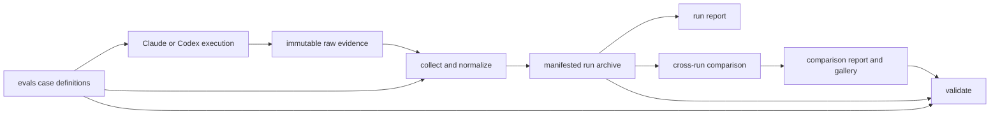

# Repository Refactor Design

## Background

The repository serves three distinct purposes: it distributes two drawing skills, defines reproducible evaluation cases, and archives evaluation evidence. Those purposes currently share paths and scripts without a stable data model. Adding the Codex + ImageGen arm exposed the resulting problems: run tools are tied to one dated archive, copied case inputs are duplicated inside a run, and a cross-run comparison is embedded in one source run's generated report.

The refactor will make the repository understandable from its root, make archived results independently verifiable, and make future runs follow the same workflow without editing Python constants. Compatibility with `claude plugin eval` is a hard boundary, so `.claude-plugin/`, `skills/`, and each `evals/<case>/case.yaml` remain in their expected locations.

The existing commit `bebd902` is the rollback point. Both current run archives will be normalized. Generated images, traces, renderer sources, raw result JSON, and published HTML are preserved byte-for-byte. Copied case inputs in the ImageGen run become manifest references to the canonical `evals/` files after their Git blob hashes are verified. A migration map records every old and new path.

## Design

### Core concepts and invariants

- A **case** is the reusable evaluation definition under `evals/<case>/`: prompt, pinned source, answer key, harness configuration, and graders.
- A **run** is immutable execution evidence from one protocol and one or more arms. It owns raw results and generated artifacts, but does not own another copy of the case definition.
- A **comparison** is derived analysis across runs or arms. It owns scores and conclusions and links to source runs; it is not embedded in either source run.
- A **manifest** is the machine-readable source of truth. Markdown files explain and navigate the same data but do not contain state that exists nowhere else.
- Migration may change paths, but it may not change raw artifact bytes. Every migrated artifact receives a recorded SHA-256 and old-to-new path entry.

### Target repository layout

```text
.
├── README.md
├── pyproject.toml
├── .claude-plugin/
├── skills/
├── evals/
│   ├── catalog.yaml
│   └── <case>/
├── runs/
│   ├── README.md
│   └── <run-id>/
│       ├── run.yaml
│       ├── README.md
│       ├── migration-map.json
│       ├── raw/
│       ├── cases/<case>/arms/<arm>/
│       └── reviews/
├── comparisons/
│   ├── README.md
│   └── <comparison-id>/
│       ├── comparison.yaml
│       ├── scores.json
│       ├── REPORT.md
│       └── GALLERY.md
├── docs/
│   ├── repository-layout.md
│   ├── evaluation-methodology.md
│   ├── repository-refactor-design.md
│   └── archive/
├── infra/
│   └── claude-eval-cloud-setup.sh
├── src/drawing_eval/
└── tests/
```

`evals/catalog.yaml` supplies repository metadata that should not be added to the Claude harness schema: stable case ID, diagram kind, expected skill, and whether the case lies inside that skill's intended domain. The existing `case.yaml` files remain harness-native.

### Public API

The repository exposes one Python command with four subcommands:

```text
python -m drawing_eval collect --run runs/<run-id> --results <results.json>
python -m drawing_eval report --run runs/<run-id>
python -m drawing_eval compare --spec comparisons/<comparison-id>/comparison.yaml
python -m drawing_eval validate --all
```

`collect` imports a raw harness result into a run described by `run.yaml`. It never depends on dated module constants or an absolute checkout path. Artifact normalization remains an explicit archival step because the Claude and Codex execution formats differ.

`report` resolves a run manifest to its maintained report. Reports remain reviewable Markdown because they contain qualitative findings that cannot be regenerated from harness output alone.

`compare` resolves a derived comparison from explicit source run and arm references. The current 27-image review becomes the first comparison. Its score table moves out of the skill run report and becomes structured `scores.json` plus a maintained `REPORT.md`.

`validate` checks the whole repository or one selected run. A nonzero exit means the archive is not publishable.

### Data flow



A case supplies the prompt and pinned evidence. An execution produces raw results. `collect` imports a result, and the archival step records protocol, arms, costs, source case hashes, and artifact hashes in a run. A run report describes only that run. `compare` resolves one or more run manifests and their derived scores. `validate` follows every reference and verifies that the repository can audit its reports without hidden local state.

### Run manifest

`run.yaml` contains:

- schema version, run ID, date, status, protocol, agent, model, and source Git commit;
- the cases and arms included in the run;
- raw result locations and artifact locations;
- per-artifact SHA-256, media dimensions, and renderer source when present;
- cost records with provenance and whether each value is observed or estimated;
- review records and links to any comparisons that consume the run;
- validation status and the validator version.

Machine-local paths, temporary workspace paths, and credentials are forbidden. Source inputs are referenced by repository path and Git blob SHA rather than copied into every run.

### Comparison manifest

`comparison.yaml` names the source runs and points to `scores.json`. `scores.json` stores the rubric, aggregate dimension scores, recommendations, and cost assumptions. The maintained Markdown report provides the per-image review and conclusions; the validator keeps its artifact links and source-run references auditable.

### Validation rules

The validator enforces these invariants:

1. Every catalog case has a complete harness definition and pinned source metadata.
2. Every run and comparison matches its schema and references existing case, run, arm, and artifact identifiers.
3. Raw artifacts match their recorded SHA-256; PNGs decode and match recorded dimensions.
4. Referenced case inputs match their recorded Git blob hashes.
5. Generated reports are reproducible and introduce no diff.
6. Local Markdown links resolve.
7. Archived metadata contains no absolute host paths or temporary workspace paths.
8. Canonical case inputs are not copied into run archives.
9. The repository contains no unclassified output outside `runs/` or `comparisons/`.

### Migration

The migration runs in a copied worktree and is applied to the live branch only after validation.

1. Add the package skeleton, schemas, validator, tests, and root documentation without moving archived data.
2. Convert the two existing archives to `run.yaml` and generate artifact hash inventories.
3. Move raw results, HTML, traces, images, and renderer sources into the normalized run layout with `git mv`.
4. Remove duplicated ImageGen case inputs only after matching all 68 Git blob hashes against canonical `evals/` inputs. Preserve their original paths and hashes in `migration-map.json`.
5. Move the 27-image analysis into `comparisons/2026-10-02-three-arm/`; remove the duplicated three-arm block from the skill run report.
6. Move the historical `PLAN.md` under `docs/archive/` and the cloud setup script under `infra/`.
7. Generate the root README, repository layout, methodology, run index, and comparison index.
8. Run the complete validator and tests, regenerate every report, and confirm that all raw artifact hashes equal the pre-migration inventory.

### Tricky parts

- The repository is a shallow, grafted checkout. Validation must use recorded blob IDs and content hashes and must not assume full Git history is locally available.
- Upstream source files contain intentional trailing whitespace. General diff checks must exclude byte-preserved vendor inputs rather than rewriting them.
- The old skill run contains smoke and superseded raw results in addition to the nine final cases. The normalized manifest must label them as historical attempts rather than silently discard them or include them in final production cost.
- Cost provenance differs by arm: Claude artifacts contain observed dollar values, while ImageGen combines recorded agent tokens with an estimated image-output tier. The schema must preserve that distinction.
- A report is derived output. Hand-edited observations must live in structured review inputs or dedicated Markdown source files, never only inside the generated report.
- Git hooks may create `.ai/gitlog.md`. `.ai/` remains outside the archive and is ignored unless the repository later adopts it explicitly.

### What changed

The refactor removes dated constants from collection and reporting, separates immutable evidence from derived interpretation, eliminates repeated copies of canonical case inputs, and creates one repository entry point. It adds schema validation and report reproducibility as archive requirements.

The skills and harness-facing case structure remain stable. The refactor does not revise skill instructions, change evaluation scores, regenerate images, or reinterpret raw Claude grader output.

## Conclusion and discussion

The target design treats the repository as a small evaluation data system: cases are inputs, runs are immutable evidence, and comparisons are derived views. This separation lets new agents and renderers be added without creating another one-off report pipeline or copying source trees into every run.

The first implementation should favor a small standard-library Python package plus Pillow and PyYAML over a larger framework. The migration is complete only when the validator proves byte preservation, all links resolve, and report regeneration produces a clean working tree.
