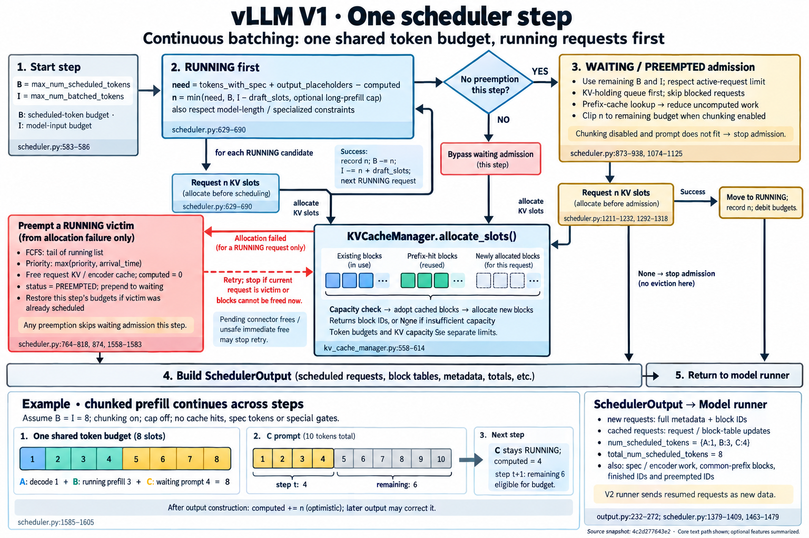
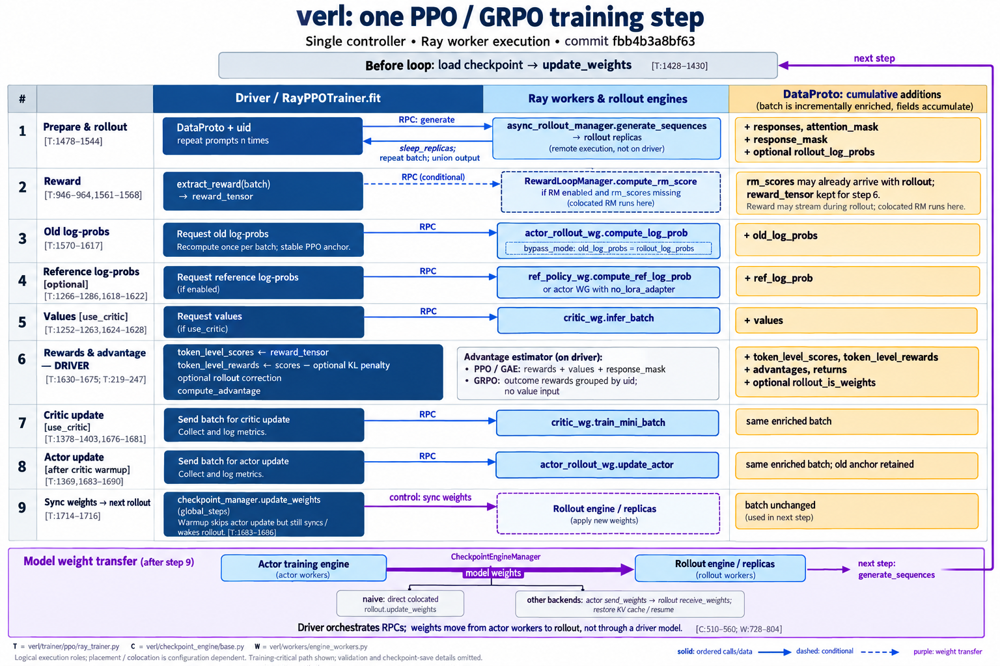
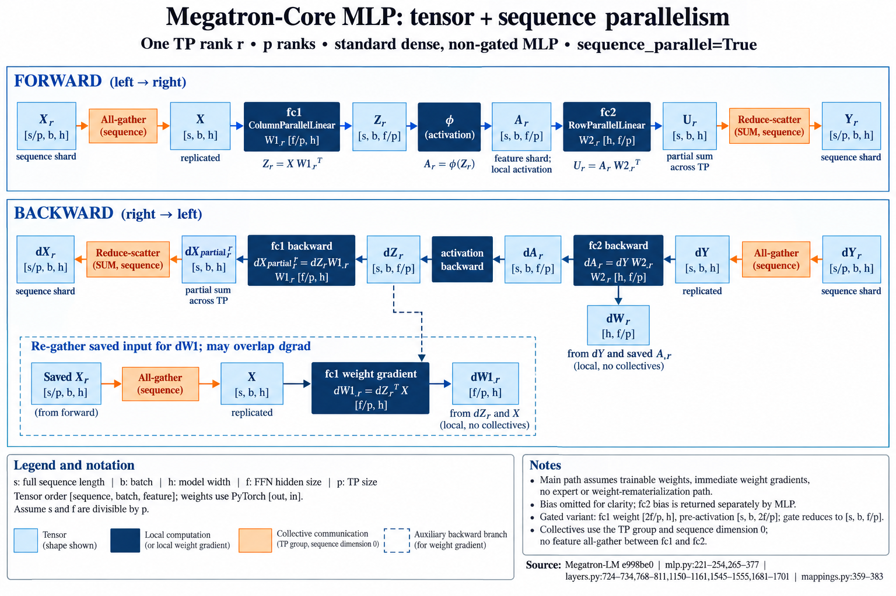
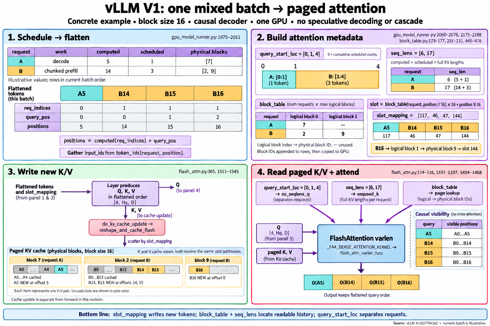
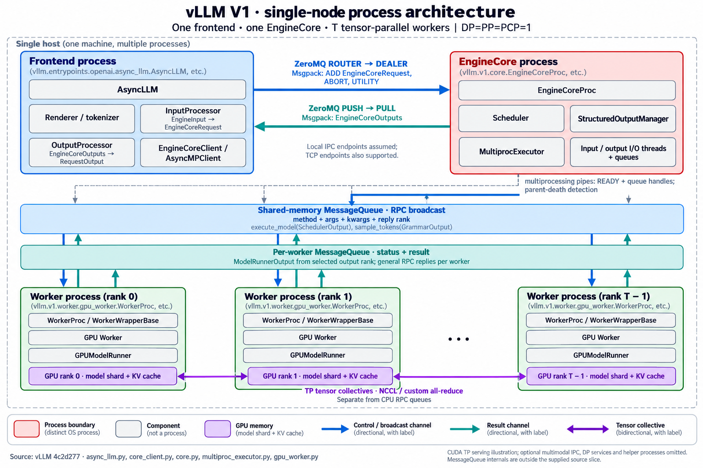

# Codex + image generation: nine original cases

One independently generated image per case, with no reference images or inherited conversation. These are first samples, not corrected illustrations. The linked QA notes are generator self-review, not independent Opus grading. Several images contain semantic mistakes; review the QA before relying on a diagram.

[Run protocol](README.md) · [Machine-readable manifest](run-manifest.json)

## G1 · vllm-v1-schedule

[Original case](cases/vllm-v1-schedule/prompt.md) · [Generation prompt](cases/vllm-v1-schedule/generation-prompt.md) · [Grounding](cases/vllm-v1-schedule/grounding.md) · [Self-QA](cases/vllm-v1-schedule/qa.md)

## G2 · verl-ppo-step

[Original case](cases/verl-ppo-step/prompt.md) · [Generation prompt](cases/verl-ppo-step/generation-prompt.md) · [Grounding](cases/verl-ppo-step/grounding.md) · [Self-QA](cases/verl-ppo-step/qa.md)

## G3 · ffmpeg-transcode-threads

[Original case](cases/ffmpeg-transcode-threads/prompt.md) · [Generation prompt](cases/ffmpeg-transcode-threads/generation-prompt.md) · [Grounding](cases/ffmpeg-transcode-threads/grounding.md) · [Self-QA](cases/ffmpeg-transcode-threads/qa.md)

## G4 · redis-request-path

[Original case](cases/redis-request-path/prompt.md) · [Generation prompt](cases/redis-request-path/generation-prompt.md) · [Grounding](cases/redis-request-path/grounding.md) · [Self-QA](cases/redis-request-path/qa.md)

## M1 · megatron-tp-sp-mlp

[Original case](cases/megatron-tp-sp-mlp/prompt.md) · [Generation prompt](cases/megatron-tp-sp-mlp/generation-prompt.md) · [Grounding](cases/megatron-tp-sp-mlp/grounding.md) · [Self-QA](cases/megatron-tp-sp-mlp/qa.md)

## M2 · vllm-v1-mixed-batch-attn

[Original case](cases/vllm-v1-mixed-batch-attn/prompt.md) · [Generation prompt](cases/vllm-v1-mixed-batch-attn/generation-prompt.md) · [Grounding](cases/vllm-v1-mixed-batch-attn/grounding.md) · [Self-QA](cases/vllm-v1-mixed-batch-attn/qa.md)

## A1 · vllm-v1-process-arch

[Original case](cases/vllm-v1-process-arch/prompt.md) · [Generation prompt](cases/vllm-v1-process-arch/generation-prompt.md) · [Grounding](cases/vllm-v1-process-arch/grounding.md) · [Self-QA](cases/vllm-v1-process-arch/qa.md)

## A2 · verl-resource-placement

[Original case](cases/verl-resource-placement/prompt.md) · [Generation prompt](cases/verl-resource-placement/generation-prompt.md) · [Grounding](cases/verl-resource-placement/grounding.md) · [Self-QA](cases/verl-resource-placement/qa.md)

## A3 · megatron-parallel-groups

[Original case](cases/megatron-parallel-groups/prompt.md) · [Generation prompt](cases/megatron-parallel-groups/generation-prompt.md) · [Grounding](cases/megatron-parallel-groups/grounding.md) · [Self-QA](cases/megatron-parallel-groups/qa.md)

